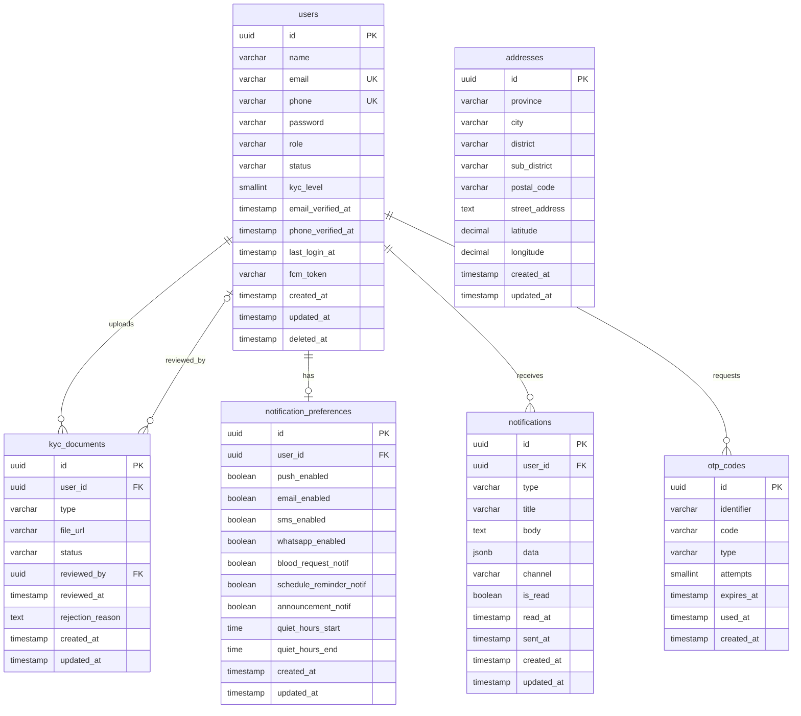
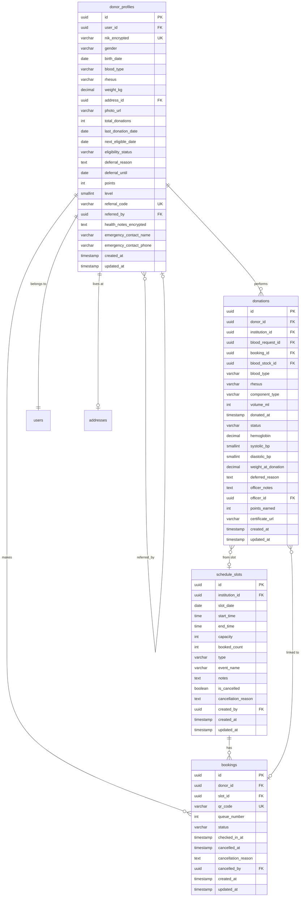
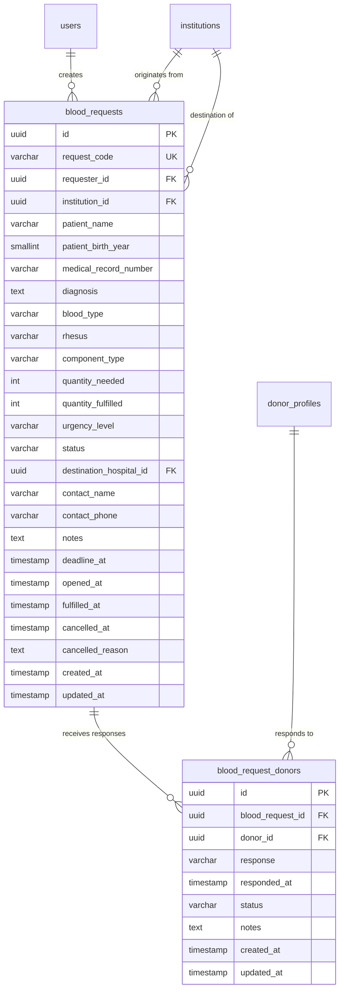
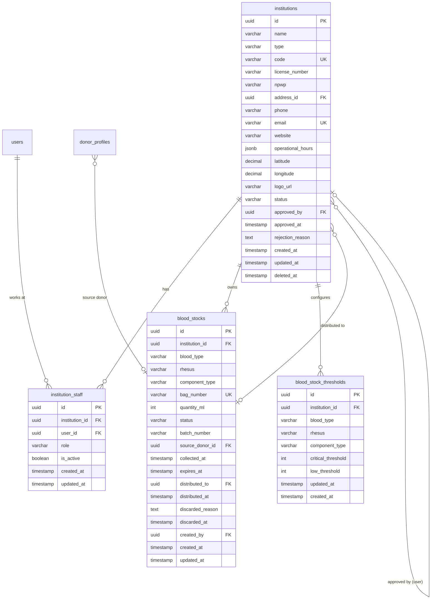
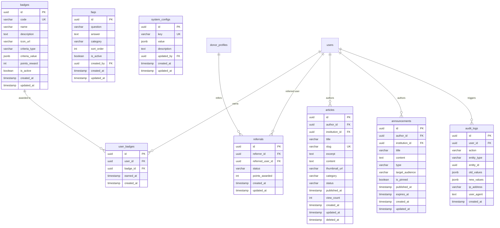

# Database Design — MARIDONOR
## PostgreSQL Schema & ERD

**Versi:** 1.0.0 (Draft)
**Tanggal:** 18 Juli 2026
**Referensi:** SRS MARIDONOR v1.0.0

---

## Daftar Isi

1. [Konvensi Desain](#1-konvensi-desain)
2. [Domain Overview](#2-domain-overview)
3. [ERD per Domain](#3-erd-per-domain)
   - [3.1 Domain: Auth & User](#31-domain-auth--user)
   - [3.2 Domain: Donor & Donation](#32-domain-donor--donation)
   - [3.3 Domain: Blood Request](#33-domain-blood-request)
   - [3.4 Domain: Institution & Stock](#34-domain-institution--stock)
   - [3.5 Domain: Content & System](#35-domain-content--system)
4. [Definisi Tabel Lengkap](#4-definisi-tabel-lengkap)
5. [Relasi Antar Tabel](#5-relasi-antar-tabel)
6. [Index & Performa](#6-index--performa)
7. [Catatan Desain](#7-catatan-desain)

---

## 1. Konvensi Desain

| Aspek | Keputusan | Alasan |
|---|---|---|
| **Primary Key** | UUID v4 | Aman untuk distributed system, tidak expose jumlah record |
| **String ID** | Tidak pakai auto-increment | Mencegah IDOR (Insecure Direct Object Reference) |
| **Timestamp** | `created_at`, `updated_at` di semua tabel | Audit trail dasar |
| **Soft Delete** | `deleted_at` nullable di tabel kritis | Pemulihan data & audit |
| **Enkripsi** | Kolom sensitif (NIK, health_notes) dienkripsi di application layer | UU PDP compliance |
| **JSONB** | Untuk data semi-terstruktur (operational_hours, config) | Fleksibilitas tanpa over-normalisasi |
| **Enum** | Disimpan sebagai `VARCHAR` + CHECK constraint | Lebih mudah di-migrate dibanding PostgreSQL native ENUM |
| **Naming** | `snake_case`, plural untuk nama tabel | Standar Laravel/PostgreSQL |
| **FK Behavior** | `ON DELETE RESTRICT` (default) kecuali disebutkan | Mencegah orphan data secara tidak sengaja |
| **Timezone** | Semua timestamp dalam UTC | Konsistensi lintas zona waktu |

---

## 2. Domain Overview

```
┌─────────────────────────────────────────────────────────────────────────┐
│                        MARIDONOR DATABASE DOMAINS                        │
│                                                                          │
│  ┌─────────────────┐     ┌──────────────────┐     ┌─────────────────┐  │
│  │  AUTH & USER    │     │ DONOR & DONATION  │     │  BLOOD REQUEST  │  │
│  │                 │     │                  │     │                 │  │
│  │  users          │────►│  donor_profiles  │────►│  blood_requests │  │
│  │  addresses      │     │  donations       │     │  blood_request_ │  │
│  │  kyc_documents  │     │  bookings        │     │    donors       │  │
│  │  otp_codes      │     │  schedule_slots  │     │                 │  │
│  │  notif_prefs    │     │                  │     │                 │  │
│  │  notifications  │     └──────────────────┘     └─────────────────┘  │
│  └─────────────────┘              │                        │            │
│                                   ▼                        ▼            │
│  ┌─────────────────┐     ┌──────────────────────────────────────────┐  │
│  │ CONTENT & SYSTEM│     │         INSTITUTION & STOCK              │  │
│  │                 │     │                                          │  │
│  │  articles       │     │  institutions     blood_stocks           │  │
│  │  announcements  │     │  institution_     blood_stock_           │  │
│  │  faqs           │     │    staff           thresholds            │  │
│  │  badges         │     │                                          │  │
│  │  user_badges    │     └──────────────────────────────────────────┘  │
│  │  referrals      │                                                    │
│  │  audit_logs     │                                                    │
│  │  system_configs │                                                    │
│  └─────────────────┘                                                    │
└─────────────────────────────────────────────────────────────────────────┘
```

**Total Tabel: 18 tabel**

---

## 3. ERD per Domain

### 3.1 Domain: Auth & User



---

### 3.2 Domain: Donor & Donation



---

### 3.3 Domain: Blood Request



---

### 3.4 Domain: Institution & Stock



---

### 3.5 Domain: Content & System



---

## 4. Definisi Tabel Lengkap

### 4.1 `users`

| Kolom | Tipe | Constraint | Default | Keterangan |
|---|---|---|---|---|
| `id` | UUID | PK, NOT NULL | `gen_random_uuid()` | Primary key |
| `name` | VARCHAR(255) | NOT NULL | — | Nama lengkap |
| `email` | VARCHAR(255) | NOT NULL, UNIQUE | — | Email login |
| `phone` | VARCHAR(20) | NOT NULL, UNIQUE | — | Nomor HP |
| `password` | VARCHAR(255) | NOT NULL | — | Bcrypt hash |
| `role` | VARCHAR(20) | NOT NULL, CHECK | — | `donor`, `patient`, `rs_staff`, `rs_admin`, `pmi_staff`, `pmi_admin`, `super_admin` |
| `status` | VARCHAR(20) | NOT NULL, CHECK | `'active'` | `active`, `suspended`, `deleted` |
| `kyc_level` | SMALLINT | NOT NULL | `0` | Level 0, 1, 2 |
| `email_verified_at` | TIMESTAMPTZ | NULLABLE | NULL | |
| `phone_verified_at` | TIMESTAMPTZ | NULLABLE | NULL | |
| `last_login_at` | TIMESTAMPTZ | NULLABLE | NULL | |
| `fcm_token` | VARCHAR(255) | NULLABLE | NULL | Firebase Cloud Messaging token |
| `remember_token` | VARCHAR(100) | NULLABLE | NULL | Laravel remember me |
| `created_at` | TIMESTAMPTZ | NOT NULL | `NOW()` | |
| `updated_at` | TIMESTAMPTZ | NOT NULL | `NOW()` | |
| `deleted_at` | TIMESTAMPTZ | NULLABLE | NULL | Soft delete |

---

### 4.2 `addresses`

| Kolom | Tipe | Constraint | Default | Keterangan |
|---|---|---|---|---|
| `id` | UUID | PK, NOT NULL | `gen_random_uuid()` | |
| `province` | VARCHAR(100) | NOT NULL | — | Provinsi |
| `city` | VARCHAR(100) | NOT NULL | — | Kota/Kabupaten |
| `district` | VARCHAR(100) | NOT NULL | — | Kecamatan |
| `sub_district` | VARCHAR(100) | NOT NULL | — | Kelurahan/Desa |
| `postal_code` | VARCHAR(10) | NOT NULL | — | Kode pos |
| `street_address` | TEXT | NOT NULL | — | Alamat jalan lengkap |
| `latitude` | DECIMAL(10,8) | NULLABLE | NULL | Koordinat GPS |
| `longitude` | DECIMAL(11,8) | NULLABLE | NULL | Koordinat GPS |
| `created_at` | TIMESTAMPTZ | NOT NULL | `NOW()` | |
| `updated_at` | TIMESTAMPTZ | NOT NULL | `NOW()` | |

---

### 4.3 `donor_profiles`

| Kolom | Tipe | Constraint | Default | Keterangan |
|---|---|---|---|---|
| `id` | UUID | PK, NOT NULL | `gen_random_uuid()` | |
| `user_id` | UUID | NOT NULL, FK→users, UNIQUE | — | Relasi 1:1 ke users |
| `nik_encrypted` | VARCHAR(500) | NOT NULL, UNIQUE | — | NIK terenkripsi (AES-256) |
| `gender` | VARCHAR(10) | NOT NULL, CHECK | — | `male`, `female` |
| `birth_date` | DATE | NOT NULL | — | Tanggal lahir |
| `blood_type` | VARCHAR(5) | NOT NULL, CHECK | — | `A`, `B`, `AB`, `O` |
| `rhesus` | VARCHAR(10) | NOT NULL, CHECK | — | `positive`, `negative` |
| `weight_kg` | DECIMAL(5,2) | NULLABLE | NULL | Berat badan (kg) |
| `address_id` | UUID | NULLABLE, FK→addresses | NULL | Alamat domisili |
| `photo_url` | VARCHAR(500) | NULLABLE | NULL | URL foto profil |
| `total_donations` | INTEGER | NOT NULL | `0` | Total donor selesai |
| `last_donation_date` | DATE | NULLABLE | NULL | Tanggal donor terakhir |
| `next_eligible_date` | DATE | NULLABLE | NULL | Tanggal eligible berikutnya |
| `eligibility_status` | VARCHAR(30) | NOT NULL, CHECK | `'eligible'` | `eligible`, `temporarily_deferred`, `permanently_deferred` |
| `deferral_reason` | TEXT | NULLABLE | NULL | Alasan penundaan |
| `deferral_until` | DATE | NULLABLE | NULL | Sampai tanggal berapa ditangguhkan |
| `points` | INTEGER | NOT NULL | `0` | Total poin gamifikasi |
| `level` | SMALLINT | NOT NULL | `1` | Level 1–5 |
| `referral_code` | VARCHAR(10) | NOT NULL, UNIQUE | — | Kode referral unik |
| `referred_by` | UUID | NULLABLE, FK→donor_profiles | NULL | Self-referential |
| `health_notes_encrypted` | TEXT | NULLABLE | NULL | Catatan kesehatan (terenkripsi) |
| `emergency_contact_name` | VARCHAR(255) | NULLABLE | NULL | |
| `emergency_contact_phone` | VARCHAR(20) | NULLABLE | NULL | |
| `created_at` | TIMESTAMPTZ | NOT NULL | `NOW()` | |
| `updated_at` | TIMESTAMPTZ | NOT NULL | `NOW()` | |

---

### 4.4 `kyc_documents`

| Kolom | Tipe | Constraint | Default | Keterangan |
|---|---|---|---|---|
| `id` | UUID | PK | `gen_random_uuid()` | |
| `user_id` | UUID | NOT NULL, FK→users | — | |
| `type` | VARCHAR(30) | NOT NULL, CHECK | — | `ktp_photo`, `selfie_ktp`, `verification_letter` |
| `file_url` | VARCHAR(500) | NOT NULL | — | URL file (storage) |
| `status` | VARCHAR(20) | NOT NULL, CHECK | `'pending'` | `pending`, `approved`, `rejected` |
| `reviewed_by` | UUID | NULLABLE, FK→users | NULL | Admin yang mereview |
| `reviewed_at` | TIMESTAMPTZ | NULLABLE | NULL | |
| `rejection_reason` | TEXT | NULLABLE | NULL | |
| `created_at` | TIMESTAMPTZ | NOT NULL | `NOW()` | |
| `updated_at` | TIMESTAMPTZ | NOT NULL | `NOW()` | |

---

### 4.5 `otp_codes`

| Kolom | Tipe | Constraint | Default | Keterangan |
|---|---|---|---|---|
| `id` | UUID | PK | `gen_random_uuid()` | |
| `identifier` | VARCHAR(255) | NOT NULL | — | Email atau nomor HP |
| `code` | VARCHAR(10) | NOT NULL | — | OTP code (hashed) |
| `type` | VARCHAR(30) | NOT NULL, CHECK | — | `phone_verify`, `email_verify`, `login`, `password_reset` |
| `attempts` | SMALLINT | NOT NULL | `0` | Jumlah percobaan salah |
| `expires_at` | TIMESTAMPTZ | NOT NULL | — | Waktu kadaluarsa (5 menit) |
| `used_at` | TIMESTAMPTZ | NULLABLE | NULL | |
| `created_at` | TIMESTAMPTZ | NOT NULL | `NOW()` | |

---

### 4.6 `notification_preferences`

| Kolom | Tipe | Constraint | Default | Keterangan |
|---|---|---|---|---|
| `id` | UUID | PK | `gen_random_uuid()` | |
| `user_id` | UUID | NOT NULL, FK→users, UNIQUE | — | Relasi 1:1 ke users |
| `push_enabled` | BOOLEAN | NOT NULL | `TRUE` | |
| `email_enabled` | BOOLEAN | NOT NULL | `TRUE` | |
| `sms_enabled` | BOOLEAN | NOT NULL | `TRUE` | |
| `whatsapp_enabled` | BOOLEAN | NOT NULL | `FALSE` | |
| `blood_request_notif` | BOOLEAN | NOT NULL | `TRUE` | |
| `schedule_reminder_notif` | BOOLEAN | NOT NULL | `TRUE` | |
| `stock_alert_notif` | BOOLEAN | NOT NULL | `TRUE` | Khusus petugas PMI/RS |
| `announcement_notif` | BOOLEAN | NOT NULL | `TRUE` | |
| `quiet_hours_start` | TIME | NULLABLE | NULL | Jam mulai senyap |
| `quiet_hours_end` | TIME | NULLABLE | NULL | Jam selesai senyap |
| `created_at` | TIMESTAMPTZ | NOT NULL | `NOW()` | |
| `updated_at` | TIMESTAMPTZ | NOT NULL | `NOW()` | |

---

### 4.7 `notifications`

| Kolom | Tipe | Constraint | Default | Keterangan |
|---|---|---|---|---|
| `id` | UUID | PK | `gen_random_uuid()` | |
| `user_id` | UUID | NOT NULL, FK→users | — | Penerima notifikasi |
| `type` | VARCHAR(30) | NOT NULL, CHECK | — | `blood_request`, `schedule_reminder`, `stock_alert`, `badge_earned`, `announcement`, `system` |
| `title` | VARCHAR(255) | NOT NULL | — | |
| `body` | TEXT | NOT NULL | — | |
| `data` | JSONB | NULLABLE | NULL | Payload tambahan (misal: request_id) |
| `channel` | VARCHAR(20) | NOT NULL, CHECK | — | `push`, `in_app`, `email`, `sms`, `whatsapp` |
| `is_read` | BOOLEAN | NOT NULL | `FALSE` | |
| `read_at` | TIMESTAMPTZ | NULLABLE | NULL | |
| `sent_at` | TIMESTAMPTZ | NULLABLE | NULL | |
| `created_at` | TIMESTAMPTZ | NOT NULL | `NOW()` | |
| `updated_at` | TIMESTAMPTZ | NOT NULL | `NOW()` | |

---

### 4.8 `institutions`

| Kolom | Tipe | Constraint | Default | Keterangan |
|---|---|---|---|---|
| `id` | UUID | PK | `gen_random_uuid()` | |
| `name` | VARCHAR(255) | NOT NULL | — | Nama institusi |
| `type` | VARCHAR(10) | NOT NULL, CHECK | — | `pmi`, `hospital` |
| `code` | VARCHAR(50) | NOT NULL, UNIQUE | — | Kode unik (misal: PMI-JKT-001) |
| `license_number` | VARCHAR(100) | NOT NULL | — | Nomor izin operasional |
| `npwp` | VARCHAR(30) | NULLABLE | NULL | |
| `address_id` | UUID | NOT NULL, FK→addresses | — | |
| `phone` | VARCHAR(20) | NOT NULL | — | |
| `email` | VARCHAR(255) | NOT NULL, UNIQUE | — | |
| `website` | VARCHAR(255) | NULLABLE | NULL | |
| `operational_hours` | JSONB | NULLABLE | NULL | `{"monday":{"open":"08:00","close":"15:00",...}}` |
| `latitude` | DECIMAL(10,8) | NOT NULL | — | |
| `longitude` | DECIMAL(11,8) | NOT NULL | — | |
| `logo_url` | VARCHAR(500) | NULLABLE | NULL | |
| `status` | VARCHAR(20) | NOT NULL, CHECK | `'pending'` | `pending`, `under_review`, `approved`, `suspended` |
| `approved_by` | UUID | NULLABLE, FK→users | NULL | Super Admin yang approve |
| `approved_at` | TIMESTAMPTZ | NULLABLE | NULL | |
| `rejection_reason` | TEXT | NULLABLE | NULL | |
| `created_at` | TIMESTAMPTZ | NOT NULL | `NOW()` | |
| `updated_at` | TIMESTAMPTZ | NOT NULL | `NOW()` | |
| `deleted_at` | TIMESTAMPTZ | NULLABLE | NULL | Soft delete |

---

### 4.9 `institution_staff`

| Kolom | Tipe | Constraint | Default | Keterangan |
|---|---|---|---|---|
| `id` | UUID | PK | `gen_random_uuid()` | |
| `institution_id` | UUID | NOT NULL, FK→institutions | — | |
| `user_id` | UUID | NOT NULL, FK→users | — | |
| `role` | VARCHAR(10) | NOT NULL, CHECK | `'staff'` | `staff`, `admin` |
| `is_active` | BOOLEAN | NOT NULL | `TRUE` | |
| `created_at` | TIMESTAMPTZ | NOT NULL | `NOW()` | |
| `updated_at` | TIMESTAMPTZ | NOT NULL | `NOW()` | |

**UNIQUE:** `(institution_id, user_id)`

---

### 4.10 `blood_stocks`

| Kolom | Tipe | Constraint | Default | Keterangan |
|---|---|---|---|---|
| `id` | UUID | PK | `gen_random_uuid()` | |
| `institution_id` | UUID | NOT NULL, FK→institutions | — | PMI/RS pemilik stok |
| `blood_type` | VARCHAR(5) | NOT NULL, CHECK | — | `A`, `B`, `AB`, `O` |
| `rhesus` | VARCHAR(10) | NOT NULL, CHECK | — | `positive`, `negative` |
| `component_type` | VARCHAR(20) | NOT NULL, CHECK | — | `whole_blood`, `prc`, `ffp`, `platelet`, `cryo` |
| `bag_number` | VARCHAR(50) | NOT NULL, UNIQUE | — | Kode kantong darah unik |
| `quantity_ml` | INTEGER | NOT NULL | — | Volume dalam mL |
| `status` | VARCHAR(20) | NOT NULL, CHECK | `'available'` | `available`, `reserved`, `distributed`, `expired`, `discarded` |
| `batch_number` | VARCHAR(50) | NOT NULL | — | Nomor batch pengambilan |
| `source_donor_id` | UUID | NULLABLE, FK→donor_profiles | NULL | Donor asal (jika diketahui) |
| `collected_at` | TIMESTAMPTZ | NOT NULL | — | Tanggal darah diambil |
| `expires_at` | TIMESTAMPTZ | NOT NULL | — | Tanggal kadaluarsa |
| `distributed_to` | UUID | NULLABLE, FK→institutions | NULL | Jika didistribusikan ke institusi lain |
| `distributed_at` | TIMESTAMPTZ | NULLABLE | NULL | |
| `discarded_reason` | TEXT | NULLABLE | NULL | |
| `discarded_at` | TIMESTAMPTZ | NULLABLE | NULL | |
| `created_by` | UUID | NOT NULL, FK→users | — | Petugas yang input |
| `created_at` | TIMESTAMPTZ | NOT NULL | `NOW()` | |
| `updated_at` | TIMESTAMPTZ | NOT NULL | `NOW()` | |

---

### 4.11 `blood_stock_thresholds`

| Kolom | Tipe | Constraint | Default | Keterangan |
|---|---|---|---|---|
| `id` | UUID | PK | `gen_random_uuid()` | |
| `institution_id` | UUID | NOT NULL, FK→institutions | — | |
| `blood_type` | VARCHAR(5) | NOT NULL, CHECK | — | |
| `rhesus` | VARCHAR(10) | NOT NULL, CHECK | — | |
| `component_type` | VARCHAR(20) | NOT NULL, CHECK | — | |
| `critical_threshold` | INTEGER | NOT NULL | `5` | Jumlah kantong kritis |
| `low_threshold` | INTEGER | NOT NULL | `10` | Jumlah kantong rendah |
| `created_at` | TIMESTAMPTZ | NOT NULL | `NOW()` | |
| `updated_at` | TIMESTAMPTZ | NOT NULL | `NOW()` | |

**UNIQUE:** `(institution_id, blood_type, rhesus, component_type)`

---

### 4.12 `blood_requests`

| Kolom | Tipe | Constraint | Default | Keterangan |
|---|---|---|---|---|
| `id` | UUID | PK | `gen_random_uuid()` | |
| `request_code` | VARCHAR(20) | NOT NULL, UNIQUE | — | Format: `REQ-YYYYMMDD-XXXX` |
| `requester_id` | UUID | NOT NULL, FK→users | — | User yang membuat request |
| `institution_id` | UUID | NULLABLE, FK→institutions | NULL | RS asal (jika dari RS) |
| `patient_name` | VARCHAR(255) | NOT NULL | — | |
| `patient_birth_year` | SMALLINT | NULLABLE | NULL | Privasi: hanya tahun lahir |
| `medical_record_number` | VARCHAR(100) | NULLABLE | NULL | No. rekam medis |
| `diagnosis` | TEXT | NULLABLE | NULL | Diagnosa singkat |
| `blood_type` | VARCHAR(5) | NOT NULL, CHECK | — | |
| `rhesus` | VARCHAR(10) | NOT NULL, CHECK | — | |
| `component_type` | VARCHAR(20) | NOT NULL, CHECK | — | |
| `quantity_needed` | INTEGER | NOT NULL | — | Jumlah kantong dibutuhkan |
| `quantity_fulfilled` | INTEGER | NOT NULL | `0` | Jumlah terpenuhi |
| `urgency_level` | VARCHAR(15) | NOT NULL, CHECK | — | `emergency`, `urgent`, `elective` |
| `status` | VARCHAR(25) | NOT NULL, CHECK | `'draft'` | `draft`, `open`, `partially_fulfilled`, `fulfilled`, `expired`, `cancelled` |
| `destination_hospital_id` | UUID | NOT NULL, FK→institutions | — | RS tujuan penerima |
| `contact_name` | VARCHAR(255) | NOT NULL | — | |
| `contact_phone` | VARCHAR(20) | NOT NULL | — | |
| `notes` | TEXT | NULLABLE | NULL | |
| `deadline_at` | TIMESTAMPTZ | NOT NULL | — | Batas waktu pemenuhan |
| `opened_at` | TIMESTAMPTZ | NULLABLE | NULL | Saat status menjadi `open` |
| `fulfilled_at` | TIMESTAMPTZ | NULLABLE | NULL | |
| `cancelled_at` | TIMESTAMPTZ | NULLABLE | NULL | |
| `cancelled_reason` | TEXT | NULLABLE | NULL | |
| `created_at` | TIMESTAMPTZ | NOT NULL | `NOW()` | |
| `updated_at` | TIMESTAMPTZ | NOT NULL | `NOW()` | |

---

### 4.13 `blood_request_donors`

| Kolom | Tipe | Constraint | Default | Keterangan |
|---|---|---|---|---|
| `id` | UUID | PK | `gen_random_uuid()` | |
| `blood_request_id` | UUID | NOT NULL, FK→blood_requests | — | |
| `donor_id` | UUID | NOT NULL, FK→donor_profiles | — | |
| `response` | VARCHAR(20) | NOT NULL, CHECK | — | `willing`, `declined`, `saved_for_later` |
| `responded_at` | TIMESTAMPTZ | NOT NULL | — | |
| `status` | VARCHAR(20) | NOT NULL, CHECK | `'confirmed'` | `confirmed`, `donated`, `cancelled` |
| `notes` | TEXT | NULLABLE | NULL | |
| `created_at` | TIMESTAMPTZ | NOT NULL | `NOW()` | |
| `updated_at` | TIMESTAMPTZ | NOT NULL | `NOW()` | |

**UNIQUE:** `(blood_request_id, donor_id)`

---

### 4.14 `donations`

| Kolom | Tipe | Constraint | Default | Keterangan |
|---|---|---|---|---|
| `id` | UUID | PK | `gen_random_uuid()` | |
| `donor_id` | UUID | NOT NULL, FK→donor_profiles | — | |
| `institution_id` | UUID | NOT NULL, FK→institutions | — | Lokasi donor |
| `blood_request_id` | UUID | NULLABLE, FK→blood_requests | NULL | Terkait request (jika ada) |
| `booking_id` | UUID | NULLABLE, FK→bookings | NULL | Terkait booking (jika ada) |
| `blood_stock_id` | UUID | NULLABLE, FK→blood_stocks | NULL | Kantong darah yang dihasilkan |
| `blood_type` | VARCHAR(5) | NOT NULL, CHECK | — | |
| `rhesus` | VARCHAR(10) | NOT NULL, CHECK | — | |
| `component_type` | VARCHAR(20) | NOT NULL, CHECK | — | |
| `volume_ml` | INTEGER | NOT NULL | — | |
| `donated_at` | TIMESTAMPTZ | NOT NULL | — | |
| `status` | VARCHAR(15) | NOT NULL, CHECK | — | `scheduled`, `completed`, `cancelled`, `deferred` |
| `hemoglobin` | DECIMAL(4,1) | NULLABLE | NULL | Hasil cek Hb (g/dL) |
| `systolic_bp` | SMALLINT | NULLABLE | NULL | Tekanan darah sistolik |
| `diastolic_bp` | SMALLINT | NULLABLE | NULL | Tekanan darah diastolik |
| `weight_at_donation` | DECIMAL(5,2) | NULLABLE | NULL | Berat saat donor (kg) |
| `deferred_reason` | TEXT | NULLABLE | NULL | Alasan jika ditangguhkan |
| `officer_notes` | TEXT | NULLABLE | NULL | Catatan petugas |
| `officer_id` | UUID | NULLABLE, FK→users | NULL | Petugas PMI/RS |
| `points_earned` | INTEGER | NOT NULL | `0` | Poin yang didapat |
| `certificate_url` | VARCHAR(500) | NULLABLE | NULL | URL sertifikat PDF |
| `created_at` | TIMESTAMPTZ | NOT NULL | `NOW()` | |
| `updated_at` | TIMESTAMPTZ | NOT NULL | `NOW()` | |

---

### 4.15 `schedule_slots`

| Kolom | Tipe | Constraint | Default | Keterangan |
|---|---|---|---|---|
| `id` | UUID | PK | `gen_random_uuid()` | |
| `institution_id` | UUID | NOT NULL, FK→institutions | — | |
| `slot_date` | DATE | NOT NULL | — | |
| `start_time` | TIME | NOT NULL | — | |
| `end_time` | TIME | NOT NULL | — | |
| `capacity` | INTEGER | NOT NULL | — | Kapasitas donor |
| `booked_count` | INTEGER | NOT NULL | `0` | Jumlah booking aktif |
| `type` | VARCHAR(15) | NOT NULL, CHECK | `'regular'` | `regular`, `event` |
| `event_name` | VARCHAR(255) | NULLABLE | NULL | Nama event donor massal |
| `notes` | TEXT | NULLABLE | NULL | |
| `is_cancelled` | BOOLEAN | NOT NULL | `FALSE` | |
| `cancellation_reason` | TEXT | NULLABLE | NULL | |
| `created_by` | UUID | NOT NULL, FK→users | — | |
| `created_at` | TIMESTAMPTZ | NOT NULL | `NOW()` | |
| `updated_at` | TIMESTAMPTZ | NOT NULL | `NOW()` | |

---

### 4.16 `bookings`

| Kolom | Tipe | Constraint | Default | Keterangan |
|---|---|---|---|---|
| `id` | UUID | PK | `gen_random_uuid()` | |
| `donor_id` | UUID | NOT NULL, FK→donor_profiles | — | |
| `slot_id` | UUID | NOT NULL, FK→schedule_slots | — | |
| `qr_code` | VARCHAR(100) | NOT NULL, UNIQUE | — | QR code untuk check-in |
| `queue_number` | INTEGER | NULLABLE | NULL | Nomor antrian |
| `status` | VARCHAR(15) | NOT NULL, CHECK | `'booked'` | `booked`, `checked_in`, `donated`, `deferred`, `cancelled`, `no_show` |
| `checked_in_at` | TIMESTAMPTZ | NULLABLE | NULL | |
| `cancelled_at` | TIMESTAMPTZ | NULLABLE | NULL | |
| `cancellation_reason` | TEXT | NULLABLE | NULL | |
| `cancelled_by` | UUID | NULLABLE, FK→users | NULL | |
| `created_at` | TIMESTAMPTZ | NOT NULL | `NOW()` | |
| `updated_at` | TIMESTAMPTZ | NOT NULL | `NOW()` | |

---

### 4.17 `badges`

| Kolom | Tipe | Constraint | Default | Keterangan |
|---|---|---|---|---|
| `id` | UUID | PK | `gen_random_uuid()` | |
| `code` | VARCHAR(50) | NOT NULL, UNIQUE | — | Kode unik (misal: `first_donor`) |
| `name` | VARCHAR(100) | NOT NULL | — | Nama badge |
| `description` | TEXT | NOT NULL | — | |
| `icon_url` | VARCHAR(500) | NOT NULL | — | |
| `criteria_type` | VARCHAR(30) | NOT NULL, CHECK | — | `donation_count`, `emergency_response`, `referral`, `streak`, `location`, `blood_type` |
| `criteria_value` | JSONB | NOT NULL | — | Konfigurasi kriteria fleksibel |
| `points_reward` | INTEGER | NOT NULL | `0` | |
| `is_active` | BOOLEAN | NOT NULL | `TRUE` | |
| `created_at` | TIMESTAMPTZ | NOT NULL | `NOW()` | |
| `updated_at` | TIMESTAMPTZ | NOT NULL | `NOW()` | |

---

### 4.18 `user_badges`

| Kolom | Tipe | Constraint | Default | Keterangan |
|---|---|---|---|---|
| `id` | UUID | PK | `gen_random_uuid()` | |
| `user_id` | UUID | NOT NULL, FK→users | — | |
| `badge_id` | UUID | NOT NULL, FK→badges | — | |
| `earned_at` | TIMESTAMPTZ | NOT NULL | `NOW()` | |
| `created_at` | TIMESTAMPTZ | NOT NULL | `NOW()` | |

**UNIQUE:** `(user_id, badge_id)`

---

### 4.19 `referrals`

| Kolom | Tipe | Constraint | Default | Keterangan |
|---|---|---|---|---|
| `id` | UUID | PK | `gen_random_uuid()` | |
| `referrer_id` | UUID | NOT NULL, FK→donor_profiles | — | Yang mengajak |
| `referred_user_id` | UUID | NOT NULL, FK→users | — | Yang diajak |
| `status` | VARCHAR(30) | NOT NULL, CHECK | `'registered'` | `registered`, `first_donation_completed` |
| `points_awarded` | INTEGER | NOT NULL | `0` | Poin diberikan ke referrer |
| `created_at` | TIMESTAMPTZ | NOT NULL | `NOW()` | |
| `updated_at` | TIMESTAMPTZ | NOT NULL | `NOW()` | |

**UNIQUE:** `(referrer_id, referred_user_id)`

---

### 4.20 `articles`

| Kolom | Tipe | Constraint | Default | Keterangan |
|---|---|---|---|---|
| `id` | UUID | PK | `gen_random_uuid()` | |
| `author_id` | UUID | NOT NULL, FK→users | — | |
| `institution_id` | UUID | NULLABLE, FK→institutions | NULL | Jika ditulis atas nama PMI |
| `title` | VARCHAR(500) | NOT NULL | — | |
| `slug` | VARCHAR(500) | NOT NULL, UNIQUE | — | URL-friendly title |
| `excerpt` | TEXT | NOT NULL | — | Ringkasan |
| `content` | TEXT | NOT NULL | — | Konten full (Markdown/HTML) |
| `thumbnail_url` | VARCHAR(500) | NULLABLE | NULL | |
| `category` | VARCHAR(30) | NOT NULL, CHECK | — | `benefit`, `myth_fact`, `preparation`, `post_donation`, `health_info` |
| `status` | VARCHAR(15) | NOT NULL, CHECK | `'draft'` | `draft`, `published`, `archived` |
| `published_at` | TIMESTAMPTZ | NULLABLE | NULL | |
| `view_count` | INTEGER | NOT NULL | `0` | |
| `created_at` | TIMESTAMPTZ | NOT NULL | `NOW()` | |
| `updated_at` | TIMESTAMPTZ | NOT NULL | `NOW()` | |
| `deleted_at` | TIMESTAMPTZ | NULLABLE | NULL | |

---

### 4.21 `announcements`

| Kolom | Tipe | Constraint | Default | Keterangan |
|---|---|---|---|---|
| `id` | UUID | PK | `gen_random_uuid()` | |
| `author_id` | UUID | NOT NULL, FK→users | — | |
| `institution_id` | UUID | NULLABLE, FK→institutions | NULL | |
| `title` | VARCHAR(500) | NOT NULL | — | |
| `content` | TEXT | NOT NULL | — | |
| `type` | VARCHAR(15) | NOT NULL, CHECK | — | `event`, `policy`, `news`, `urgent` |
| `target_audience` | VARCHAR(15) | NOT NULL, CHECK | `'all'` | `all`, `donors`, `rs_staff`, `pmi_staff` |
| `is_pinned` | BOOLEAN | NOT NULL | `FALSE` | |
| `published_at` | TIMESTAMPTZ | NULLABLE | NULL | |
| `expires_at` | TIMESTAMPTZ | NULLABLE | NULL | |
| `created_at` | TIMESTAMPTZ | NOT NULL | `NOW()` | |
| `updated_at` | TIMESTAMPTZ | NOT NULL | `NOW()` | |

---

### 4.22 `faqs`

| Kolom | Tipe | Constraint | Default | Keterangan |
|---|---|---|---|---|
| `id` | UUID | PK | `gen_random_uuid()` | |
| `question` | TEXT | NOT NULL | — | |
| `answer` | TEXT | NOT NULL | — | |
| `category` | VARCHAR(100) | NOT NULL | — | |
| `sort_order` | INTEGER | NOT NULL | `0` | |
| `is_active` | BOOLEAN | NOT NULL | `TRUE` | |
| `created_by` | UUID | NOT NULL, FK→users | — | |
| `created_at` | TIMESTAMPTZ | NOT NULL | `NOW()` | |
| `updated_at` | TIMESTAMPTZ | NOT NULL | `NOW()` | |

---

### 4.23 `audit_logs`

| Kolom | Tipe | Constraint | Default | Keterangan |
|---|---|---|---|---|
| `id` | UUID | PK | `gen_random_uuid()` | |
| `user_id` | UUID | NULLABLE, FK→users | NULL | Nullable (aksi sistem) |
| `action` | VARCHAR(100) | NOT NULL | — | Misal: `blood_stock.created` |
| `entity_type` | VARCHAR(100) | NOT NULL | — | Nama model |
| `entity_id` | UUID | NULLABLE | NULL | ID entitas terkait |
| `old_values` | JSONB | NULLABLE | NULL | Nilai sebelum perubahan |
| `new_values` | JSONB | NULLABLE | NULL | Nilai setelah perubahan |
| `ip_address` | VARCHAR(45) | NOT NULL | — | IPv4/IPv6 |
| `user_agent` | TEXT | NULLABLE | NULL | |
| `created_at` | TIMESTAMPTZ | NOT NULL | `NOW()` | |

> [!NOTE]
> `audit_logs` tidak memiliki `updated_at` — log bersifat immutable (tidak bisa diubah).

---

### 4.24 `system_configs`

| Kolom | Tipe | Constraint | Default | Keterangan |
|---|---|---|---|---|
| `id` | UUID | PK | `gen_random_uuid()` | |
| `key` | VARCHAR(100) | NOT NULL, UNIQUE | — | Misal: `donor_search_radius_km` |
| `value` | JSONB | NOT NULL | — | Nilai konfigurasi (fleksibel) |
| `description` | TEXT | NOT NULL | — | Penjelasan konfigurasi |
| `updated_by` | UUID | NULLABLE, FK→users | NULL | |
| `created_at` | TIMESTAMPTZ | NOT NULL | `NOW()` | |
| `updated_at` | TIMESTAMPTZ | NOT NULL | `NOW()` | |

---

## 5. Relasi Antar Tabel

```
TABEL                    RELASI              TABEL
─────────────────────────────────────────────────────────────────────
users                    1 : 1               donor_profiles
users                    1 : 1               notification_preferences
users                    1 : N               kyc_documents
users                    1 : N               notifications
users                    1 : N               otp_codes (via identifier)
users                    1 : N               blood_requests (requester)
users                    1 : N               audit_logs
users                    M : N               institutions (via institution_staff)
users                    M : N               badges (via user_badges)

donor_profiles           1 : N               donations
donor_profiles           1 : N               bookings
donor_profiles           M : N               blood_requests (via blood_request_donors)
donor_profiles           1 : N               referrals (sebagai referrer)
donor_profiles           self M : 1          donor_profiles (referred_by)

institutions             1 : N               blood_stocks
institutions             1 : N               blood_stock_thresholds
institutions             1 : N               schedule_slots
institutions             1 : N               institution_staff
institutions             1 : N               blood_requests (asal & tujuan)
institutions             1 : N               donations (lokasi)
institutions             1 : N               articles (opsional)
institutions             1 : N               announcements (opsional)

blood_requests           1 : N               blood_request_donors
blood_requests           1 : N               donations (opsional)
blood_stocks             1 : N               donations (opsional)

schedule_slots           1 : N               bookings
bookings                 1 : 1               donations (opsional)

addresses                1 : N               donor_profiles
addresses                1 : 1               institutions
```

---

## 6. Index & Performa

### Index Utama

```sql
-- users
CREATE INDEX idx_users_email ON users(email) WHERE deleted_at IS NULL;
CREATE INDEX idx_users_phone ON users(phone) WHERE deleted_at IS NULL;
CREATE INDEX idx_users_role ON users(role);
CREATE INDEX idx_users_status ON users(status);

-- donor_profiles
CREATE INDEX idx_donor_profiles_blood ON donor_profiles(blood_type, rhesus);
CREATE INDEX idx_donor_profiles_eligibility ON donor_profiles(eligibility_status);
CREATE INDEX idx_donor_profiles_location ON donor_profiles(address_id);
CREATE INDEX idx_donor_profiles_next_eligible ON donor_profiles(next_eligible_date);

-- blood_stocks
CREATE INDEX idx_blood_stocks_institution ON blood_stocks(institution_id);
CREATE INDEX idx_blood_stocks_type ON blood_stocks(blood_type, rhesus, component_type);
CREATE INDEX idx_blood_stocks_status ON blood_stocks(status);
CREATE INDEX idx_blood_stocks_expires ON blood_stocks(expires_at) WHERE status = 'available';

-- blood_requests
CREATE INDEX idx_blood_requests_status ON blood_requests(status);
CREATE INDEX idx_blood_requests_urgency ON blood_requests(urgency_level, status);
CREATE INDEX idx_blood_requests_blood ON blood_requests(blood_type, rhesus, component_type);
CREATE INDEX idx_blood_requests_deadline ON blood_requests(deadline_at) WHERE status = 'open';
CREATE INDEX idx_blood_requests_requester ON blood_requests(requester_id);

-- notifications
CREATE INDEX idx_notifications_user ON notifications(user_id, is_read);
CREATE INDEX idx_notifications_created ON notifications(created_at DESC);

-- donations
CREATE INDEX idx_donations_donor ON donations(donor_id);
CREATE INDEX idx_donations_institution ON donations(institution_id);
CREATE INDEX idx_donations_donated_at ON donations(donated_at DESC);

-- bookings
CREATE INDEX idx_bookings_donor ON bookings(donor_id, status);
CREATE INDEX idx_bookings_slot ON bookings(slot_id);

-- schedule_slots
CREATE INDEX idx_schedule_slots_institution_date ON schedule_slots(institution_id, slot_date);

-- audit_logs
CREATE INDEX idx_audit_logs_user ON audit_logs(user_id);
CREATE INDEX idx_audit_logs_entity ON audit_logs(entity_type, entity_id);
CREATE INDEX idx_audit_logs_created ON audit_logs(created_at DESC);
```

### GIS Index (untuk pencarian berbasis lokasi)

```sql
-- Untuk fitur radius pencarian donor
-- Menggunakan PostGIS extension
CREATE EXTENSION IF NOT EXISTS postgis;

-- Tambahkan kolom geometry di institutions
ALTER TABLE institutions ADD COLUMN location GEOGRAPHY(POINT, 4326);

-- Index spasial
CREATE INDEX idx_institutions_location ON institutions USING GIST(location);

-- Alternatif tanpa PostGIS: gunakan formula Haversine di application layer
-- (latitude, longitude sudah disimpan sebagai DECIMAL)
```

> [!TIP]
> Jika tidak ingin menggunakan PostGIS, pencarian radius bisa menggunakan **Haversine formula** di query SQL atau di application layer. Pertimbangkan PostGIS jika fitur peta dan geospasial akan banyak digunakan.

---

## 7. Catatan Desain

### 7.1 Kenapa UUID bukan Auto-Increment?
- Mencegah **enumeration attack** (user tidak bisa menebak ID entitas lain)
- Aman untuk **distributed system** di masa depan
- PostgreSQL mendukung `gen_random_uuid()` secara native

### 7.2 Kenapa `VARCHAR` untuk Enum bukan PostgreSQL Native ENUM?
- PostgreSQL native `ENUM` sulit di-alter (perlu DDL baru)
- `VARCHAR` + `CHECK` constraint lebih mudah di-migrate saat ada perubahan nilai enum
- Laravel Eloquent lebih mudah menangani cast ke `VARCHAR`

### 7.3 Enkripsi Kolom Sensitif
Kolom yang dienkripsi di **application layer** (bukan database level):
- `donor_profiles.nik_encrypted` — NIK sangat sensitif (UU PDP)
- `donor_profiles.health_notes_encrypted` — Data kesehatan = data sensitif
- `kyc_documents.file_url` — URL file dokumen identitas

**Metode:** AES-256-CBC dengan Laravel `encrypt()` / `decrypt()`

### 7.4 Soft Delete
Tabel yang menggunakan soft delete (`deleted_at`):
- `users` — Data user tidak langsung dihapus (30 hari retensi)
- `institutions` — Riwayat institusi perlu dipertahankan
- `articles` — Konten yang diarsipkan

### 7.5 Desain `blood_stock_thresholds`
Threshold stok kritis dipisah ke tabel sendiri agar **setiap institusi bisa mengkonfigurasi threshold yang berbeda** per kombinasi golongan darah + komponen. Ini lebih fleksibel dibanding konfigurasi global di `system_configs`.

### 7.6 Desain `operational_hours` sebagai JSONB
```json
{
  "monday":    { "is_open": true,  "open": "08:00", "close": "15:00" },
  "tuesday":   { "is_open": true,  "open": "08:00", "close": "15:00" },
  "wednesday": { "is_open": true,  "open": "08:00", "close": "15:00" },
  "thursday":  { "is_open": true,  "open": "08:00", "close": "15:00" },
  "friday":    { "is_open": true,  "open": "08:00", "close": "12:00" },
  "saturday":  { "is_open": true,  "open": "08:00", "close": "12:00" },
  "sunday":    { "is_open": false }
}
```

### 7.7 Desain `badges.criteria_value` sebagai JSONB
Memungkinkan kriteria badge yang fleksibel tanpa perlu migrasi kolom baru:
```json
// Kriteria donation_count
{ "minimum_count": 10 }

// Kriteria streak
{ "consecutive_donations": 3, "max_gap_days": 180 }

// Kriteria emergency_response
{ "minimum_responses": 1 }

// Kriteria location
{ "minimum_cities": 3 }
```

### 7.8 `audit_logs` adalah Immutable
- Tidak ada `updated_at`
- Tidak ada soft delete
- Pertimbangkan **table partitioning** by `created_at` untuk performa jangka panjang

---

> [!IMPORTANT]
> **Status Dokumen:** Draft v1.0 — Perlu review sebelum pembuatan migration. Pastikan semua enum value sudah sesuai dengan kebutuhan bisnis.

> [!NOTE]
> **Open Questions:**
> 1. Apakah perlu **PostGIS** untuk fitur geospasial, atau cukup Haversine formula?
> 2. Apakah `audit_logs` perlu **partisi tabel** dari awal, atau cukup diimplementasikan nanti?
> 3. Apakah `articles.content` disimpan sebagai **Markdown atau HTML**?
> 4. Apakah perlu tabel `personal_access_tokens` (Laravel Sanctum) didokumentasikan?

---

*Dokumen dibuat: 18 Juli 2026 | Revisi berikutnya: setelah review tim*
