# User Flow — MARIDONOR
## Alur Pengguna per Role

**Versi:** 1.0.0 (Draft)
**Tanggal:** 18 Juli 2026
**Referensi:** SRS MARIDONOR v1.0.0

---

## Daftar Isi

1. [User (Donor)](#1-user-donor)
   - [1.1 Registrasi & Onboarding](#11-registrasi--onboarding)
   - [1.2 Merespons Permintaan Darah](#12-merespons-permintaan-darah)
   - [1.3 Booking Jadwal Donor](#13-booking-jadwal-donor)
   - [1.4 Membuat Permintaan Darah](#14-membuat-permintaan-darah-untuk-keluarga)
   - [1.5 Dashboard & Gamifikasi](#15-dashboard--gamifikasi)
2. [Admin PMI](#2-admin-pmi)
   - [2.1 Registrasi & Onboarding PMI](#21-registrasi--onboarding-pmi)
   - [2.2 Manajemen Stok Darah](#22-manajemen-stok-darah)
   - [2.3 Manajemen Permintaan Darah](#23-manajemen-permintaan-darah)
   - [2.4 Manajemen Jadwal & Event](#24-manajemen-jadwal--event-donor)
   - [2.5 Pelaporan](#25-pelaporan)
3. [Super Admin](#3-super-admin)
   - [3.1 Approval Institusi](#31-approval-institusi)
   - [3.2 Manajemen User](#32-manajemen-user)
   - [3.3 Konfigurasi Sistem](#33-konfigurasi-sistem)
   - [3.4 Manajemen Konten](#34-manajemen-konten--pengumuman)
4. [Rumah Sakit](#4-rumah-sakit)
   - [4.1 Registrasi & Onboarding RS](#41-registrasi--onboarding-rs)
   - [4.2 Membuat Permintaan Darah](#42-membuat-permintaan-darah)
   - [4.3 Manajemen Stok Internal](#43-manajemen-stok-internal-rs)
   - [4.4 Manajemen Jadwal Donor](#44-manajemen-jadwal-donor-di-rs)
   - [4.5 Pelaporan RS](#45-pelaporan-rs)

---

## 1. USER (Donor)

### 1.1 Registrasi & Onboarding

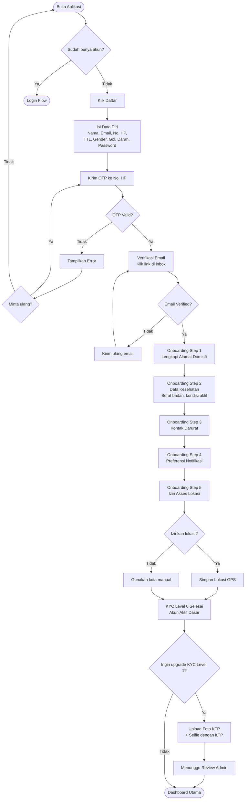
```mermaid
flowchart TD
    A([Buka Aplikasi]) --> B{Sudah punya akun?}

    B -- Tidak --> C[Klik Daftar]
    B -- Ya --> Z([Login Flow])

    C --> D[Isi Data Diri\nNama, Email, No. HP,\nTTL, Gender, Gol. Darah, Password]
    D --> E[Kirim OTP ke No. HP]
    E --> F{OTP Valid?}

    F -- Tidak --> G[Tampilkan Error]
    G --> H{Minta ulang?}
    H -- Ya --> E
    H -- Tidak --> A

    F -- Ya --> I[Verifikasi Email\nKlik link di inbox]
    I --> J{Email Verified?}

    J -- Tidak --> K[Kirim ulang email]
    K --> I

    J -- Ya --> L[Onboarding Step 1\nLengkapi Alamat Domisili]
    L --> M[Onboarding Step 2\nData Kesehatan\nBerat badan, kondisi aktif]
    M --> N[Onboarding Step 3\nKontak Darurat]
    N --> O[Onboarding Step 4\nPreferensi Notifikasi]
    O --> P[Onboarding Step 5\nIzin Akses Lokasi]

    P --> Q{Izinkan lokasi?}
    Q -- Ya --> R[Simpan Lokasi GPS]
    Q -- Tidak --> S[Gunakan kota manual]

    R --> T[KYC Level 0 Selesai\nAkun Aktif Dasar]
    S --> T

    T --> U{Ingin upgrade KYC Level 1?}
    U -- Ya --> V[Upload Foto KTP\n+ Selfie dengan KTP]
    V --> W[Menunggu Review Admin]
    W --> X([Dashboard Utama])
    U -- Tidak --> X
```

---

### 1.2 Merespons Permintaan Darah

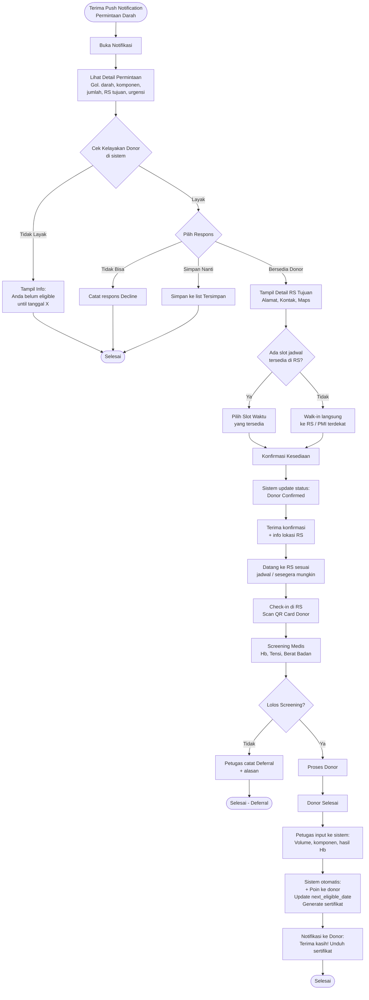
```mermaid
flowchart TD
    A([Terima Push Notification\nPermintaan Darah]) --> B[Buka Notifikasi]
    B --> C[Lihat Detail Permintaan\nGol. darah, komponen,\njumlah, RS tujuan, urgensi]

    C --> D{Cek Kelayakan Donor\ndi sistem}

    D -- Tidak Layak --> E[Tampil Info:\nAnda belum eligible\nuntil tanggal X]
    E --> F([Selesai])

    D -- Layak --> G{Pilih Respons}

    G -- Bersedia Donor --> H[Tampil Detail RS Tujuan\nAlamat, Kontak, Maps]
    G -- Tidak Bisa --> I[Catat respons Decline]
    G -- Simpan Nanti --> J[Simpan ke list Tersimpan]

    I --> F
    J --> F

    H --> K{Ada slot jadwal\ntersedia di RS?}
    K -- Ya --> L[Pilih Slot Waktu\nyang tersedia]
    K -- Tidak --> M[Walk-in langsung\nke RS / PMI terdekat]

    L --> N[Konfirmasi Kesediaan]
    M --> N

    N --> O[Sistem update status:\nDonor Confirmed]
    O --> P[Terima konfirmasi\n+ info lokasi RS]
    P --> Q[Datang ke RS sesuai\njadwal / sesegera mungkin]

    Q --> R[Check-in di RS\nScan QR Card Donor]
    R --> S[Screening Medis\nHb, Tensi, Berat Badan]

    S --> T{Lolos Screening?}
    T -- Tidak --> U[Petugas catat Deferral\n+ alasan]
    T -- Ya --> V[Proses Donor]

    U --> W([Selesai - Deferral])
    V --> X[Donor Selesai]
    X --> Y[Petugas input ke sistem:\nVolume, komponen, hasil Hb]
    Y --> Z[Sistem otomatis:\n+ Poin ke donor\nUpdate next_eligible_date\nGenerate sertifikat]
    Z --> AA[Notifikasi ke Donor:\nTerima kasih! Unduh sertifikat]
    AA --> AB([Selesai])
```

---

### 1.3 Booking Jadwal Donor

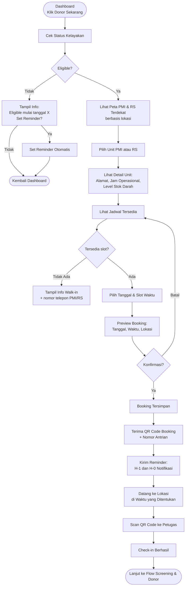
```mermaid
flowchart TD
    A([Dashboard\nKlik Donor Sekarang]) --> B[Cek Status Kelayakan]

    B --> C{Eligible?}
    C -- Tidak --> D[Tampil Info:\nEligible mulai tanggal X\nSet Reminder?]
    D -- Ya --> E[Set Reminder Otomatis]
    D -- Tidak --> F([Kembali Dashboard])
    E --> F

    C -- Ya --> G[Lihat Peta PMI & RS Terdekat\nberbasis lokasi]
    G --> H[Pilih Unit PMI atau RS]
    H --> I[Lihat Detail Unit:\nAlamat, Jam Operasional,\nLevel Stok Darah]
    I --> J[Lihat Jadwal Tersedia]
    J --> K{Tersedia slot?}

    K -- Tidak Ada --> L[Tampil Info Walk-in\n+ nomor telepon PMI/RS]
    K -- Ada --> M[Pilih Tanggal & Slot Waktu]

    M --> N[Preview Booking:\nTanggal, Waktu, Lokasi]
    N --> O{Konfirmasi?}
    O -- Batal --> J
    O -- Ya --> P[Booking Tersimpan]
    P --> Q[Terima QR Code Booking\n+ Nomor Antrian]
    Q --> R[Kirim Reminder:\nH-1 dan H-0 Notifikasi]
    R --> S[Datang ke Lokasi\ndi Waktu yang Ditentukan]
    S --> T[Scan QR Code ke Petugas]
    T --> U[Check-in Berhasil]
    U --> V([Lanjut ke Flow Screening & Donor])
```

---

### 1.4 Membuat Permintaan Darah (untuk Keluarga)

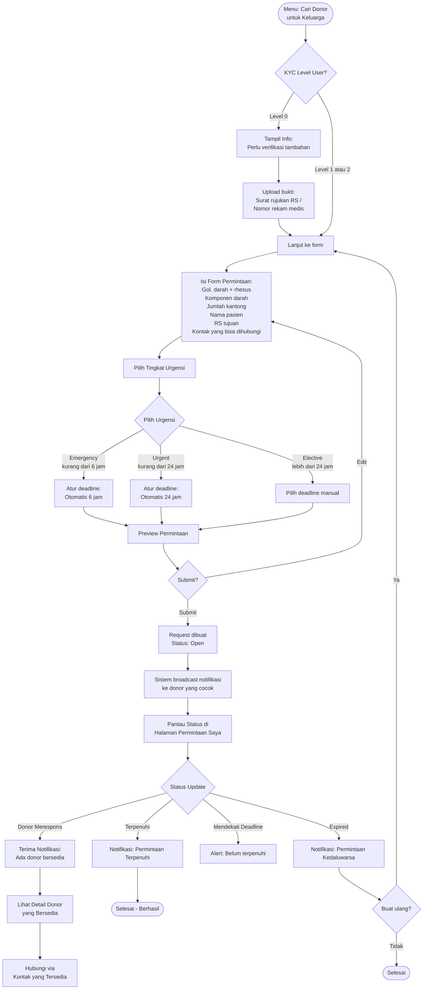
```mermaid
flowchart TD
    A([Menu: Cari Donor\nuntuk Keluarga]) --> B{KYC Level User?}

    B -- Level 0 --> C[Tampil Info:\nPerlu verifikasi tambahan]
    C --> D[Upload bukti:\nSurat rujukan RS /\nNomor rekam medis]
    D --> E[Lanjut ke form]

    B -- Level 1 atau 2 --> E

    E --> F[Isi Form Permintaan:\nGol. darah + rhesus\nKomponen darah\nJumlah kantong\nNama pasien\nRS tujuan\nKontak yang bisa dihubungi]
    F --> G[Pilih Tingkat Urgensi]

    G --> H{Pilih Urgensi}
    H -- Emergency\nkurang dari 6 jam --> I[Atur deadline:\nOtomatis 6 jam]
    H -- Urgent\nkurang dari 24 jam --> J[Atur deadline:\nOtomatis 24 jam]
    H -- Elective\nlebih dari 24 jam --> K[Pilih deadline manual]

    I --> L[Preview Permintaan]
    J --> L
    K --> L

    L --> M{Submit?}
    M -- Edit --> F
    M -- Submit --> N[Request dibuat\nStatus: Open]
    N --> O[Sistem broadcast notifikasi\nke donor yang cocok]
    O --> P[Pantau Status di\nHalaman Permintaan Saya]

    P --> Q{Status Update}
    Q -- Donor Merespons --> R[Terima Notifikasi:\nAda donor bersedia]
    Q -- Terpenuhi --> S[Notifikasi: Permintaan Terpenuhi]
    Q -- Mendekati Deadline --> T[Alert: Belum terpenuhi]
    Q -- Expired --> U[Notifikasi: Permintaan Kedaluwarsa]

    R --> V[Lihat Detail Donor\nyang Bersedia]
    V --> W[Hubungi via\nKontak yang Tersedia]
    S --> X([Selesai - Berhasil])
    U --> Y{Buat ulang?}
    Y -- Ya --> E
    Y -- Tidak --> Z([Selesai])
```

---

### 1.5 Dashboard & Gamifikasi

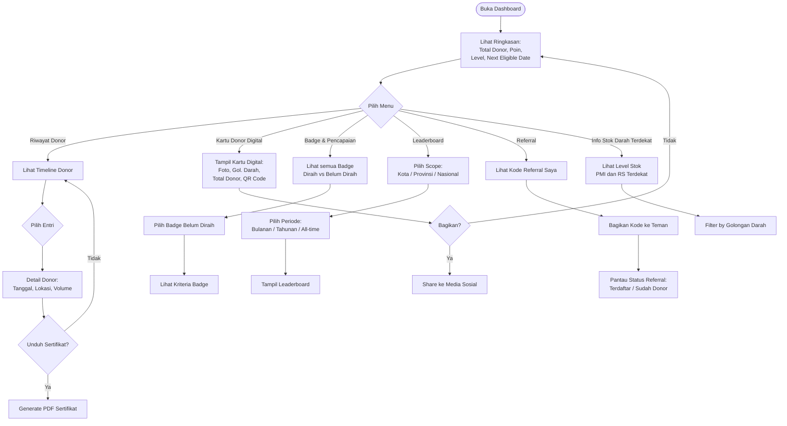
```mermaid
flowchart TD
    A([Buka Dashboard]) --> B[Lihat Ringkasan:\nTotal Donor, Poin,\nLevel, Next Eligible Date]

    B --> C{Pilih Menu}

    C -- Riwayat Donor --> D[Lihat Timeline Donor]
    D --> E{Pilih Entri}
    E --> F[Detail Donor:\nTanggal, Lokasi, Volume]
    F --> G{Unduh Sertifikat?}
    G -- Ya --> H[Generate PDF Sertifikat]
    G -- Tidak --> D

    C -- Kartu Donor Digital --> I[Tampil Kartu Digital:\nFoto, Gol. Darah,\nTotal Donor, QR Code]
    I --> J{Bagikan?}
    J -- Ya --> K[Share ke Media Sosial]
    J -- Tidak --> B

    C -- Badge & Pencapaian --> L[Lihat semua Badge\nDiraih vs Belum Diraih]
    L --> M[Pilih Badge Belum Diraih]
    M --> N[Lihat Kriteria Badge]

    C -- Leaderboard --> O[Pilih Scope:\nKota / Provinsi / Nasional]
    O --> P[Pilih Periode:\nBulanan / Tahunan / All-time]
    P --> Q[Tampil Leaderboard]

    C -- Referral --> R[Lihat Kode Referral Saya]
    R --> S[Bagikan Kode ke Teman]
    S --> T[Pantau Status Referral:\nTerdaftar / Sudah Donor]

    C -- Info Stok Darah Terdekat --> U[Lihat Level Stok\nPMI dan RS Terdekat]
    U --> V[Filter by Golongan Darah]
```

---

## 2. ADMIN PMI

### 2.1 Registrasi & Onboarding PMI

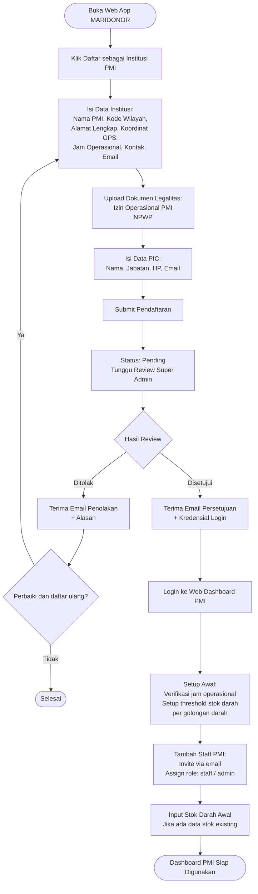
```mermaid
flowchart TD
    A([Buka Web App MARIDONOR]) --> B[Klik Daftar sebagai Institusi PMI]
    B --> C[Isi Data Institusi:\nNama PMI, Kode Wilayah,\nAlamat Lengkap, Koordinat GPS,\nJam Operasional, Kontak, Email]
    C --> D[Upload Dokumen Legalitas:\nIzin Operasional PMI\nNPWP]
    D --> E[Isi Data PIC:\nNama, Jabatan, HP, Email]
    E --> F[Submit Pendaftaran]
    F --> G[Status: Pending\nTunggu Review Super Admin]
    G --> H{Hasil Review}

    H -- Ditolak --> I[Terima Email Penolakan\n+ Alasan]
    I --> J{Perbaiki dan daftar ulang?}
    J -- Ya --> C
    J -- Tidak --> K([Selesai])

    H -- Disetujui --> L[Terima Email Persetujuan\n+ Kredensial Login]
    L --> M[Login ke Web Dashboard PMI]
    M --> N[Setup Awal:\nVerifikasi jam operasional\nSetup threshold stok darah\nper golongan darah]
    N --> O[Tambah Staff PMI:\nInvite via email\nAssign role: staff / admin]
    O --> P[Input Stok Darah Awal\nJika ada data stok existing]
    P --> Q([Dashboard PMI Siap Digunakan])
```

---

### 2.2 Manajemen Stok Darah

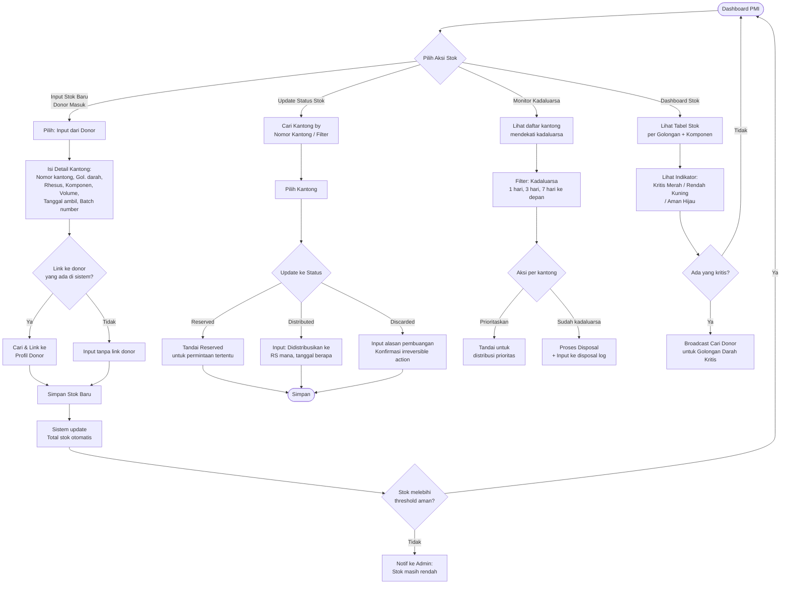
```mermaid
flowchart TD
    A([Dashboard PMI]) --> B{Pilih Aksi Stok}

    B -- Input Stok Baru\nDonor Masuk --> C[Pilih: Input dari Donor]
    C --> D[Isi Detail Kantong:\nNomor kantong, Gol. darah,\nRhesus, Komponen, Volume,\nTanggal ambil, Batch number]
    D --> E{Link ke donor\nyang ada di sistem?}
    E -- Ya --> F[Cari & Link ke\nProfil Donor]
    E -- Tidak --> G[Input tanpa link donor]
    F --> H[Simpan Stok Baru]
    G --> H
    H --> I[Sistem update\nTotal stok otomatis]
    I --> J{Stok melebihi\nthreshold aman?}
    J -- Ya --> A
    J -- Tidak --> K[Notif ke Admin:\nStok masih rendah]

    B -- Update Status Stok --> L[Cari Kantong by\nNomor Kantong / Filter]
    L --> M[Pilih Kantong]
    M --> N{Update ke Status}
    N -- Reserved --> O[Tandai Reserved\nuntuk permintaan tertentu]
    N -- Distributed --> P[Input: Didistribusikan ke\nRS mana, tanggal berapa]
    N -- Discarded --> Q[Input alasan pembuangan\nKonfirmasi irreversible action]
    O --> R([Simpan])
    P --> R
    Q --> R

    B -- Monitor Kadaluarsa --> S[Lihat daftar kantong\nmendekati kadaluarsa]
    S --> T[Filter: Kadaluarsa\n1 hari, 3 hari, 7 hari ke depan]
    T --> U{Aksi per kantong}
    U -- Prioritaskan --> V[Tandai untuk\ndistribusi prioritas]
    U -- Sudah kadaluarsa --> W[Proses Disposal\n+ Input ke disposal log]

    B -- Dashboard Stok --> X[Lihat Tabel Stok\nper Golongan + Komponen]
    X --> Y[Lihat Indikator:\nKritis Merah / Rendah Kuning\n/ Aman Hijau]
    Y --> Z{Ada yang kritis?}
    Z -- Ya --> AA[Broadcast Cari Donor\nuntuk Golongan Darah Kritis]
    Z -- Tidak --> A
```

---

### 2.3 Manajemen Permintaan Darah

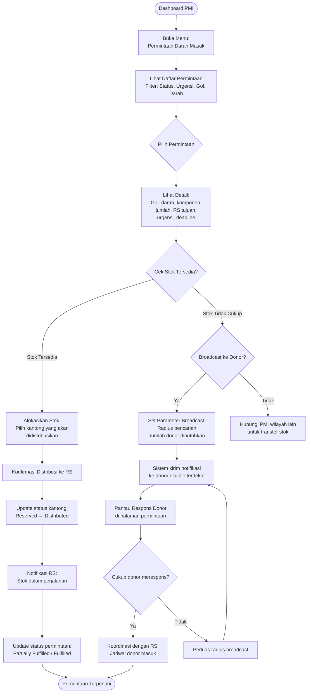
```mermaid
flowchart TD
    A([Dashboard PMI]) --> B[Buka Menu:\nPermintaan Darah Masuk]
    B --> C[Lihat Daftar Permintaan\nFilter: Status, Urgensi, Gol. Darah]

    C --> D{Pilih Permintaan}

    D --> E[Lihat Detail:\nGol. darah, komponen,\njumlah, RS tujuan,\nurgensi, deadline]

    E --> F{Cek Stok Tersedia?}

    F -- Stok Tersedia --> G[Alokasikan Stok:\nPilih kantong yang akan\ndidistribusikan]
    G --> H[Konfirmasi Distribusi ke RS]
    H --> I[Update status kantong:\nReserved → Distributed]
    I --> J[Notifikasi RS:\nStok dalam perjalanan]
    J --> K[Update status permintaan:\nPartially Fulfilled / Fulfilled]

    F -- Stok Tidak Cukup --> L{Broadcast ke Donor?}
    L -- Ya --> M[Set Parameter Broadcast:\nRadius pencarian\nJumlah donor dibutuhkan]
    M --> N[Sistem kirim notifikasi\nke donor eligible terdekat]
    N --> O[Pantau Respons Donor\ndi halaman permintaan]
    O --> P{Cukup donor merespons?}
    P -- Ya --> Q[Koordinasi dengan RS:\nJadwal donor masuk]
    P -- Tidak --> R[Perluas radius broadcast]
    R --> N
    L -- Tidak --> S[Hubungi PMI wilayah lain\nuntuk transfer stok]

    Q --> T([Permintaan Terpenuhi])
    K --> T
```

---

### 2.4 Manajemen Jadwal & Event Donor

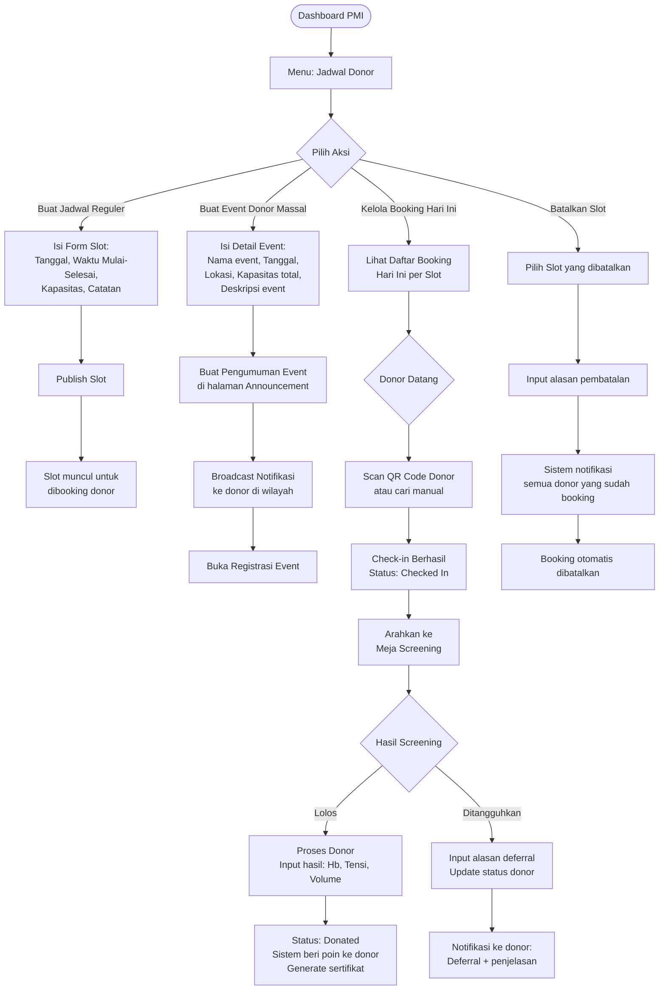
```mermaid
flowchart TD
    A([Dashboard PMI]) --> B[Menu: Jadwal Donor]

    B --> C{Pilih Aksi}

    C -- Buat Jadwal Reguler --> D[Isi Form Slot:\nTanggal, Waktu Mulai-Selesai,\nKapasitas, Catatan]
    D --> E[Publish Slot]
    E --> F[Slot muncul untuk\ndibooking donor]

    C -- Buat Event Donor Massal --> G[Isi Detail Event:\nNama event, Tanggal,\nLokasi, Kapasitas total,\nDeskripsi event]
    G --> H[Buat Pengumuman Event\ndi halaman Announcement]
    H --> I[Broadcast Notifikasi\nke donor di wilayah]
    I --> J[Buka Registrasi Event]

    C -- Kelola Booking Hari Ini --> K[Lihat Daftar Booking\nHari Ini per Slot]
    K --> L{Donor Datang}
    L --> M[Scan QR Code Donor\natau cari manual]
    M --> N[Check-in Berhasil\nStatus: Checked In]
    N --> O[Arahkan ke\nMeja Screening]
    O --> P{Hasil Screening}
    P -- Lolos --> Q[Proses Donor\nInput hasil: Hb, Tensi, Volume]
    P -- Ditangguhkan --> R[Input alasan deferral\nUpdate status donor]
    Q --> S[Status: Donated\nSistem beri poin ke donor\nGenerate sertifikat]
    R --> T[Notifikasi ke donor:\nDeferral + penjelasan]

    C -- Batalkan Slot --> U[Pilih Slot yang dibatalkan]
    U --> V[Input alasan pembatalan]
    V --> W[Sistem notifikasi\nsemua donor yang sudah booking]
    W --> X[Booking otomatis dibatalkan]
```

---

### 2.5 Pelaporan

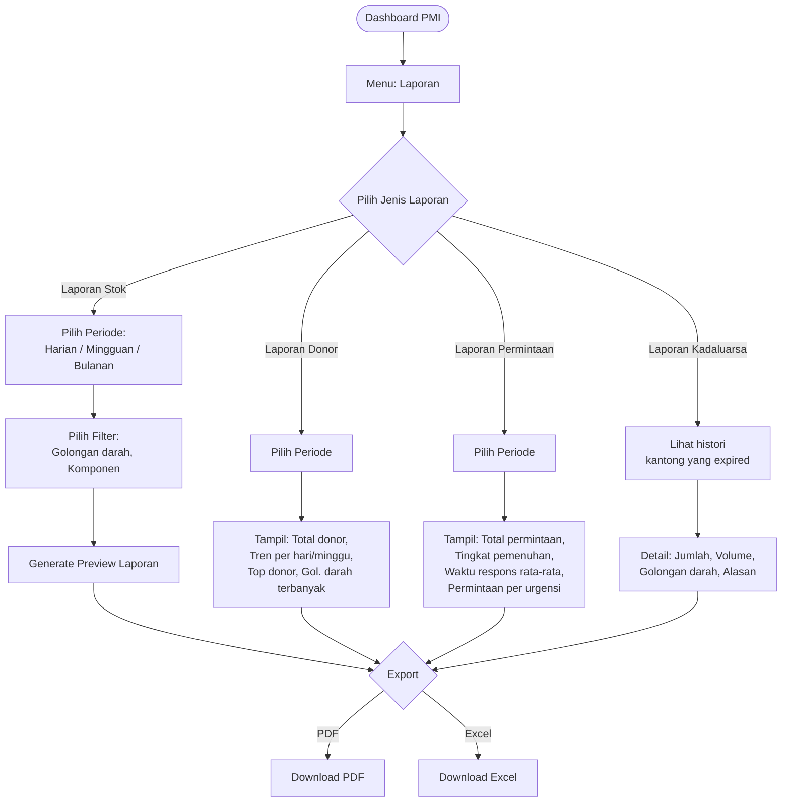
```mermaid
flowchart TD
    A([Dashboard PMI]) --> B[Menu: Laporan]
    B --> C{Pilih Jenis Laporan}

    C -- Laporan Stok --> D[Pilih Periode:\nHarian / Mingguan / Bulanan]
    D --> E[Pilih Filter:\nGolongan darah, Komponen]
    E --> F[Generate Preview Laporan]
    F --> G{Export}
    G -- PDF --> H[Download PDF]
    G -- Excel --> I[Download Excel]

    C -- Laporan Donor --> J[Pilih Periode]
    J --> K[Tampil: Total donor,\nTren per hari/minggu,\nTop donor, Gol. darah terbanyak]
    K --> G

    C -- Laporan Permintaan --> L[Pilih Periode]
    L --> M[Tampil: Total permintaan,\nTingkat pemenuhan,\nWaktu respons rata-rata,\nPermintaan per urgensi]
    M --> G

    C -- Laporan Kadaluarsa --> N[Lihat histori\nkantong yang expired]
    N --> O[Detail: Jumlah, Volume,\nGolongan darah, Alasan]
    O --> G
```

---

## 3. SUPER ADMIN

### 3.1 Approval Institusi

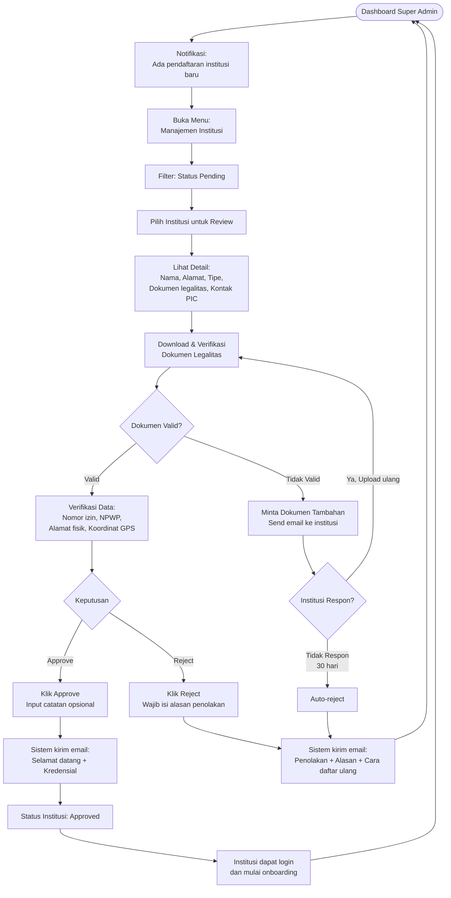
```mermaid
flowchart TD
    A([Dashboard Super Admin]) --> B[Notifikasi:\nAda pendaftaran institusi baru]
    B --> C[Buka Menu:\nManajemen Institusi]
    C --> D[Filter: Status Pending]
    D --> E[Pilih Institusi untuk Review]
    E --> F[Lihat Detail:\nNama, Alamat, Tipe,\nDokumen legalitas, Kontak PIC]

    F --> G[Download & Verifikasi\nDokumen Legalitas]
    G --> H{Dokumen Valid?}

    H -- Tidak Valid --> I[Minta Dokumen Tambahan\nSend email ke institusi]
    I --> J{Institusi Respon?}
    J -- Ya, Upload ulang --> G
    J -- Tidak Respon\n30 hari --> K[Auto-reject]

    H -- Valid --> L[Verifikasi Data:\nNomor izin, NPWP,\nAlamat fisik, Koordinat GPS]
    L --> M{Keputusan}

    M -- Approve --> N[Klik Approve\nInput catatan opsional]
    N --> O[Sistem kirim email:\nSelamat datang + Kredensial]
    O --> P[Status Institusi: Approved]
    P --> Q[Institusi dapat login\ndan mulai onboarding]

    M -- Reject --> R[Klik Reject\nWajib isi alasan penolakan]
    R --> S[Sistem kirim email:\nPenolakan + Alasan + Cara daftar ulang]

    K --> S
    Q --> A
    S --> A
```

---

### 3.2 Manajemen User

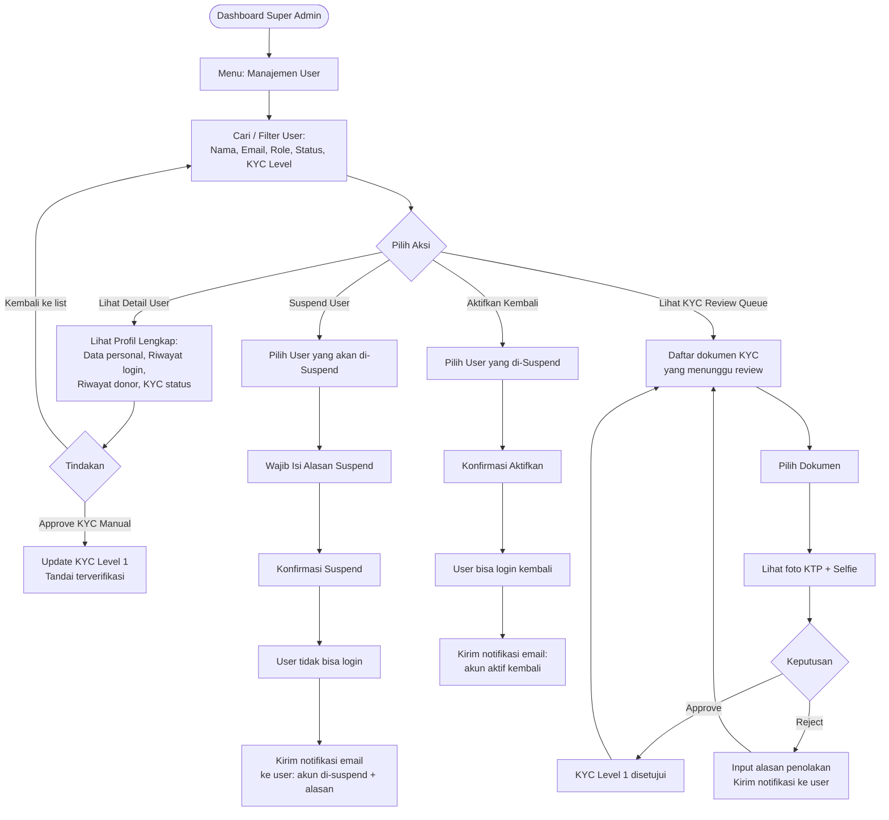
```mermaid
flowchart TD
    A([Dashboard Super Admin]) --> B[Menu: Manajemen User]
    B --> C[Cari / Filter User:\nNama, Email, Role, Status, KYC Level]

    C --> D{Pilih Aksi}

    D -- Lihat Detail User --> E[Lihat Profil Lengkap:\nData personal, Riwayat login,\nRiwayat donor, KYC status]
    E --> F{Tindakan}
    F -- Approve KYC Manual --> G[Update KYC Level 1\nTandai terverifikasi]
    F -- Kembali ke list --> C

    D -- Suspend User --> H[Pilih User yang akan di-Suspend]
    H --> I[Wajib Isi Alasan Suspend]
    I --> J[Konfirmasi Suspend]
    J --> K[User tidak bisa login]
    K --> L[Kirim notifikasi email\nke user: akun di-suspend + alasan]

    D -- Aktifkan Kembali --> M[Pilih User yang di-Suspend]
    M --> N[Konfirmasi Aktifkan]
    N --> O[User bisa login kembali]
    O --> P[Kirim notifikasi email:\nakun aktif kembali]

    D -- Lihat KYC Review Queue --> Q[Daftar dokumen KYC\nyang menunggu review]
    Q --> R[Pilih Dokumen]
    R --> S[Lihat foto KTP + Selfie]
    S --> T{Keputusan}
    T -- Approve --> U[KYC Level 1 disetujui]
    T -- Reject --> V[Input alasan penolakan\nKirim notifikasi ke user]
    U --> Q
    V --> Q
```

---

### 3.3 Konfigurasi Sistem

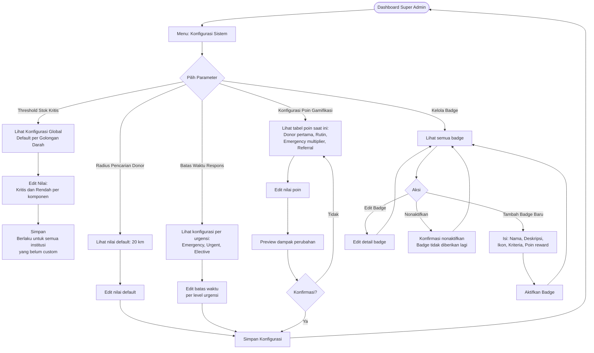
```mermaid
flowchart TD
    A([Dashboard Super Admin]) --> B[Menu: Konfigurasi Sistem]
    B --> C{Pilih Parameter}

    C -- Threshold Stok Kritis --> D[Lihat Konfigurasi Global\nDefault per Golongan Darah]
    D --> E[Edit Nilai:\nKritis dan Rendah per komponen]
    E --> F[Simpan\nBerlaku untuk semua institusi\nyang belum custom]

    C -- Radius Pencarian Donor --> G[Lihat nilai default: 20 km]
    G --> H[Edit nilai default]
    H --> I[Simpan Konfigurasi]

    C -- Batas Waktu Respons --> J[Lihat konfigurasi per urgensi:\nEmergency, Urgent, Elective]
    J --> K[Edit batas waktu\nper level urgensi]
    K --> I

    C -- Konfigurasi Poin Gamifikasi --> L[Lihat tabel poin saat ini:\nDonor pertama, Rutin,\nEmergency multiplier, Referral]
    L --> M[Edit nilai poin]
    M --> N[Preview dampak perubahan]
    N --> O{Konfirmasi?}
    O -- Ya --> I
    O -- Tidak --> L

    C -- Kelola Badge --> P[Lihat semua badge]
    P --> Q{Aksi}
    Q -- Tambah Badge Baru --> R[Isi: Nama, Deskripsi,\nIkon, Kriteria, Poin reward]
    R --> S[Aktifkan Badge]
    Q -- Edit Badge --> T[Edit detail badge]
    Q -- Nonaktifkan --> U[Konfirmasi nonaktifkan\nBadge tidak diberikan lagi]
    S --> P
    T --> P
    U --> P

    I --> A
```

---

### 3.4 Manajemen Konten & Pengumuman

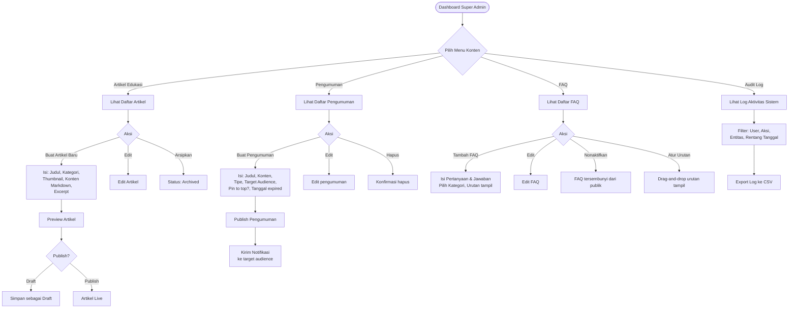
```mermaid
flowchart TD
    A([Dashboard Super Admin]) --> B{Pilih Menu Konten}

    B -- Artikel Edukasi --> C[Lihat Daftar Artikel]
    C --> D{Aksi}
    D -- Buat Artikel Baru --> E[Isi: Judul, Kategori,\nThumbnail, Konten Markdown,\nExcerpt]
    E --> F[Preview Artikel]
    F --> G{Publish?}
    G -- Draft --> H[Simpan sebagai Draft]
    G -- Publish --> I[Artikel Live]
    D -- Edit --> J[Edit Artikel]
    D -- Arsipkan --> K[Status: Archived]

    B -- Pengumuman --> L[Lihat Daftar Pengumuman]
    L --> M{Aksi}
    M -- Buat Pengumuman --> N[Isi: Judul, Konten,\nTipe, Target Audience,\nPin to top?, Tanggal expired]
    N --> O[Publish Pengumuman]
    O --> P[Kirim Notifikasi\nke target audience]
    M -- Edit --> Q[Edit pengumuman]
    M -- Hapus --> R[Konfirmasi hapus]

    B -- FAQ --> S[Lihat Daftar FAQ]
    S --> T{Aksi}
    T -- Tambah FAQ --> U[Isi Pertanyaan & Jawaban\nPilih Kategori, Urutan tampil]
    T -- Edit --> V[Edit FAQ]
    T -- Nonaktifkan --> W[FAQ tersembunyi dari publik]
    T -- Atur Urutan --> X[Drag-and-drop urutan tampil]

    B -- Audit Log --> Y[Lihat Log Aktivitas Sistem]
    Y --> Z[Filter: User, Aksi,\nEntitas, Rentang Tanggal]
    Z --> AA[Export Log ke CSV]
```

---

## 4. RUMAH SAKIT

### 4.1 Registrasi & Onboarding RS

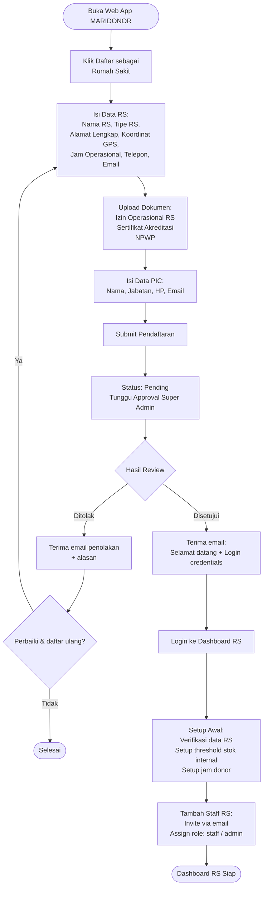
```mermaid
flowchart TD
    A([Buka Web App MARIDONOR]) --> B[Klik Daftar sebagai\nRumah Sakit]
    B --> C[Isi Data RS:\nNama RS, Tipe RS,\nAlamat Lengkap, Koordinat GPS,\nJam Operasional, Telepon, Email]
    C --> D[Upload Dokumen:\nIzin Operasional RS\nSertifikat Akreditasi\nNPWP]
    D --> E[Isi Data PIC:\nNama, Jabatan, HP, Email]
    E --> F[Submit Pendaftaran]
    F --> G[Status: Pending\nTunggu Approval Super Admin]
    G --> H{Hasil Review}

    H -- Ditolak --> I[Terima email penolakan\n+ alasan]
    I --> J{Perbaiki & daftar ulang?}
    J -- Ya --> C
    J -- Tidak --> K([Selesai])

    H -- Disetujui --> L[Terima email:\nSelamat datang + Login credentials]
    L --> M[Login ke Dashboard RS]
    M --> N[Setup Awal:\nVerifikasi data RS\nSetup threshold stok internal\nSetup jam donor]
    N --> O[Tambah Staff RS:\nInvite via email\nAssign role: staff / admin]
    O --> P([Dashboard RS Siap])
```

---

### 4.2 Membuat Permintaan Darah

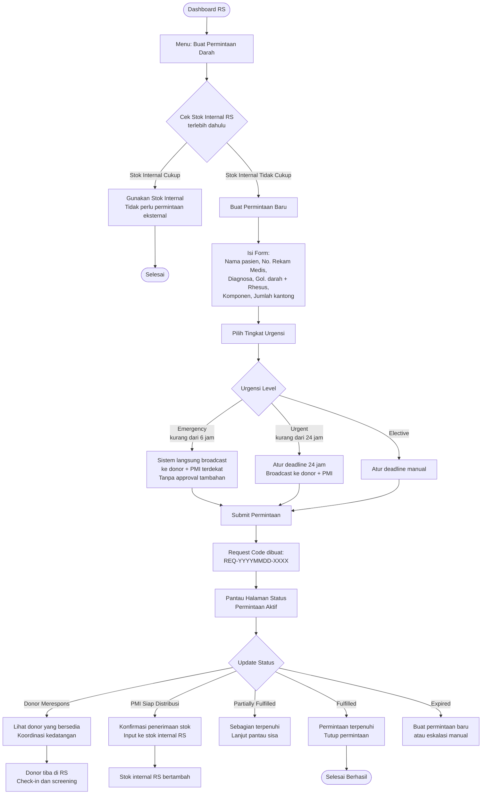
```mermaid
flowchart TD
    A([Dashboard RS]) --> B[Menu: Buat Permintaan Darah]
    B --> C{Cek Stok Internal RS\nterlebih dahulu}

    C -- Stok Internal Cukup --> D[Gunakan Stok Internal\nTidak perlu permintaan eksternal]
    D --> E([Selesai])

    C -- Stok Internal Tidak Cukup --> F[Buat Permintaan Baru]
    F --> G[Isi Form:\nNama pasien, No. Rekam Medis,\nDiagnosa, Gol. darah + Rhesus,\nKomponen, Jumlah kantong]
    G --> H[Pilih Tingkat Urgensi]

    H --> I{Urgensi Level}

    I -- Emergency\nkurang dari 6 jam --> J[Sistem langsung broadcast\nke donor + PMI terdekat\nTanpa approval tambahan]
    I -- Urgent\nkurang dari 24 jam --> K[Atur deadline 24 jam\nBroadcast ke donor + PMI]
    I -- Elective --> L[Atur deadline manual]

    J --> M[Submit Permintaan]
    K --> M
    L --> M

    M --> N[Request Code dibuat:\nREQ-YYYYMMDD-XXXX]
    N --> O[Pantau Halaman Status\nPermintaan Aktif]

    O --> P{Update Status}
    P -- Donor Merespons --> Q[Lihat donor yang bersedia\nKoordinasi kedatangan]
    P -- PMI Siap Distribusi --> R[Konfirmasi penerimaan stok\nInput ke stok internal RS]
    P -- Partially Fulfilled --> S[Sebagian terpenuhi\nLanjut pantau sisa]
    P -- Fulfilled --> T[Permintaan terpenuhi\nTutup permintaan]
    P -- Expired --> U[Buat permintaan baru\natau eskalasi manual]

    Q --> V[Donor tiba di RS\nCheck-in dan screening]
    R --> W[Stok internal RS bertambah]
    T --> X([Selesai Berhasil])
```

---

### 4.3 Manajemen Stok Internal RS

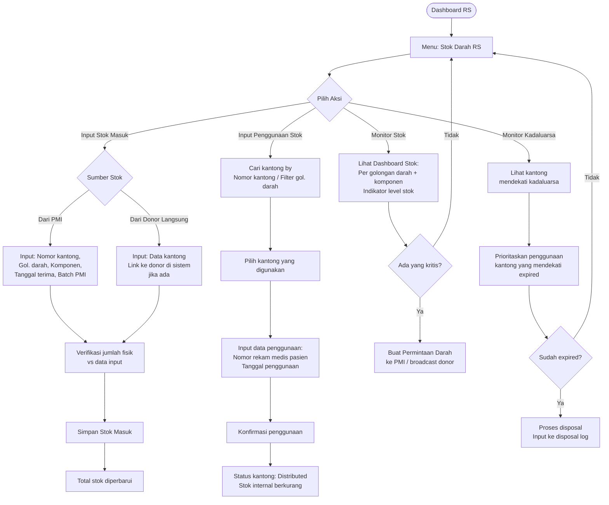
```mermaid
flowchart TD
    A([Dashboard RS]) --> B[Menu: Stok Darah RS]
    B --> C{Pilih Aksi}

    C -- Input Stok Masuk --> D{Sumber Stok}
    D -- Dari PMI --> E[Input: Nomor kantong,\nGol. darah, Komponen,\nTanggal terima, Batch PMI]
    D -- Dari Donor Langsung --> F[Input: Data kantong\nLink ke donor di sistem\njika ada]
    E --> G[Verifikasi jumlah fisik\nvs data input]
    F --> G
    G --> H[Simpan Stok Masuk]
    H --> I[Total stok diperbarui]

    C -- Input Penggunaan Stok --> J[Cari kantong by\nNomor kantong / Filter gol. darah]
    J --> K[Pilih kantong yang digunakan]
    K --> L[Input data penggunaan:\nNomor rekam medis pasien\nTanggal penggunaan]
    L --> M[Konfirmasi penggunaan]
    M --> N[Status kantong: Distributed\nStok internal berkurang]

    C -- Monitor Stok --> O[Lihat Dashboard Stok:\nPer golongan darah + komponen\nIndikator level stok]
    O --> P{Ada yang kritis?}
    P -- Ya --> Q[Buat Permintaan Darah\nke PMI / broadcast donor]
    P -- Tidak --> B

    C -- Monitor Kadaluarsa --> R[Lihat kantong\nmendekati kadaluarsa]
    R --> S[Prioritaskan penggunaan\nkantong yang mendekati expired]
    S --> T{Sudah expired?}
    T -- Ya --> U[Proses disposal\nInput ke disposal log]
    T -- Tidak --> B
```

---

### 4.4 Manajemen Jadwal Donor di RS

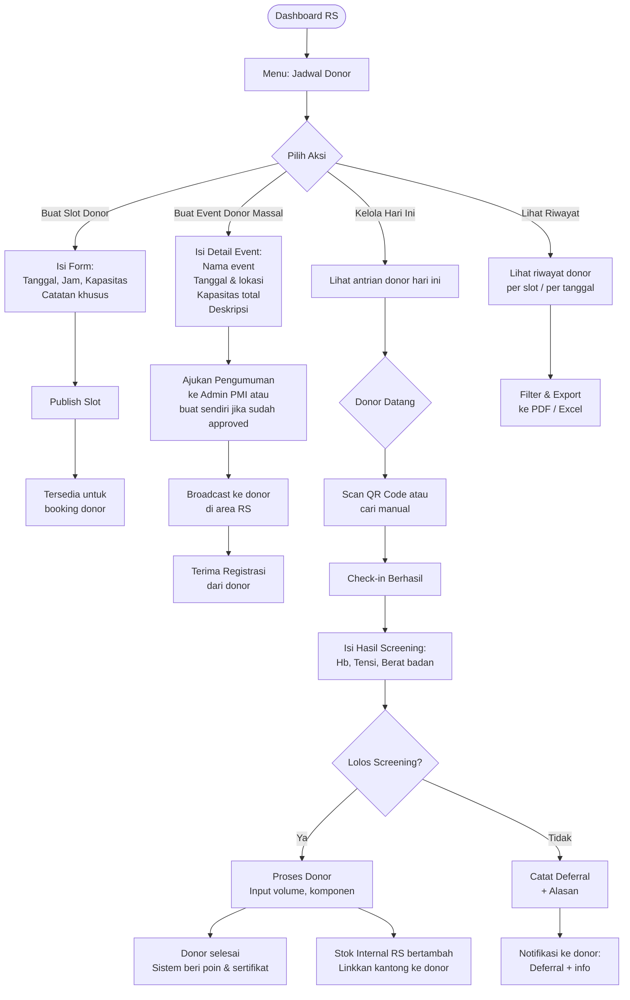
```mermaid
flowchart TD
    A([Dashboard RS]) --> B[Menu: Jadwal Donor]
    B --> C{Pilih Aksi}

    C -- Buat Slot Donor --> D[Isi Form:\nTanggal, Jam, Kapasitas\nCatatan khusus]
    D --> E[Publish Slot]
    E --> F[Tersedia untuk\nbooking donor]

    C -- Buat Event Donor Massal --> G[Isi Detail Event:\nNama event\nTanggal & lokasi\nKapasitas total\nDeskripsi]
    G --> H[Ajukan Pengumuman\nke Admin PMI atau\nbuat sendiri jika sudah approved]
    H --> I[Broadcast ke donor\ndi area RS]
    I --> J[Terima Registrasi\ndari donor]

    C -- Kelola Hari Ini --> K[Lihat antrian donor hari ini]
    K --> L{Donor Datang}
    L --> M[Scan QR Code atau\ncari manual]
    M --> N[Check-in Berhasil]
    N --> O[Isi Hasil Screening:\nHb, Tensi, Berat badan]
    O --> P{Lolos Screening?}
    P -- Ya --> Q[Proses Donor\nInput volume, komponen]
    P -- Tidak --> R[Catat Deferral\n+ Alasan]
    Q --> S[Donor selesai\nSistem beri poin & sertifikat]
    Q --> T[Stok Internal RS bertambah\nLinkkan kantong ke donor]
    R --> U[Notifikasi ke donor:\nDeferral + info]

    C -- Lihat Riwayat --> V[Lihat riwayat donor\nper slot / per tanggal]
    V --> W[Filter & Export\nke PDF / Excel]
```

---

### 4.5 Pelaporan RS

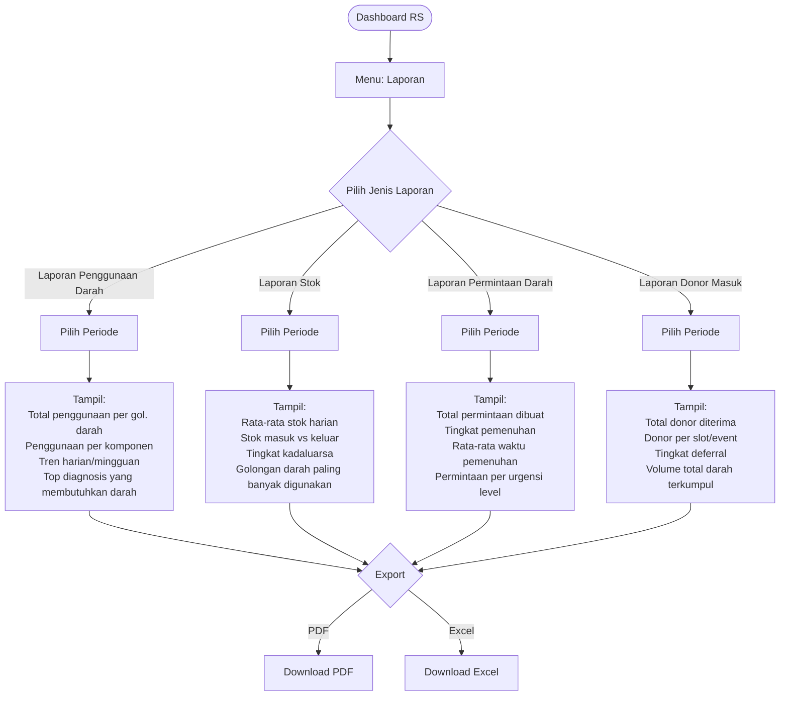
```mermaid
flowchart TD
    A([Dashboard RS]) --> B[Menu: Laporan]
    B --> C{Pilih Jenis Laporan}

    C -- Laporan Penggunaan Darah --> D[Pilih Periode]
    D --> E[Tampil:\nTotal penggunaan per gol. darah\nPenggunaan per komponen\nTren harian/mingguan\nTop diagnosis yang membutuhkan darah]
    E --> F{Export}
    F -- PDF --> G[Download PDF]
    F -- Excel --> H[Download Excel]

    C -- Laporan Stok --> I[Pilih Periode]
    I --> J[Tampil:\nRata-rata stok harian\nStok masuk vs keluar\nTingkat kadaluarsa\nGolongan darah paling banyak digunakan]
    J --> F

    C -- Laporan Permintaan Darah --> K[Pilih Periode]
    K --> L[Tampil:\nTotal permintaan dibuat\nTingkat pemenuhan\nRata-rata waktu pemenuhan\nPermintaan per urgensi level]
    L --> F

    C -- Laporan Donor Masuk --> M[Pilih Periode]
    M --> N[Tampil:\nTotal donor diterima\nDonor per slot/event\nTingkat deferral\nVolume total darah terkumpul]
    N --> F
```

---

## Ringkasan Cross-Role Interaction

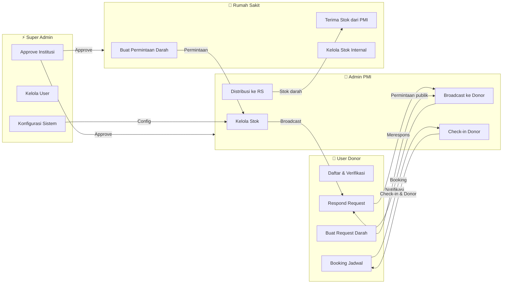
```mermaid
flowchart LR
    subgraph USER["👤 User Donor"]
        U1[Daftar & Verifikasi]
        U2[Respond Request]
        U3[Booking Jadwal]
        U4[Buat Request Darah]
    end

    subgraph PMI["🏥 Admin PMI"]
        P1[Kelola Stok]
        P2[Broadcast ke Donor]
        P3[Check-in Donor]
        P4[Distribusi ke RS]
    end

    subgraph RS["🏨 Rumah Sakit"]
        R1[Buat Permintaan Darah]
        R2[Terima Stok dari PMI]
        R3[Kelola Stok Internal]
    end

    subgraph SA["⚡ Super Admin"]
        S1[Approve Institusi]
        S2[Kelola User]
        S3[Konfigurasi Sistem]
    end

    U2 -->|Merespons| P2
    P2 -->|Notifikasi| U2
    P3 -->|Check-in & Donor| U3
    U3 -->|Booking| P3
    R1 -->|Permintaan| P1
    P4 -->|Stok darah| R2
    P1 -->|Broadcast| U2
    S1 -->|Approve| PMI
    S1 -->|Approve| RS
    S3 -->|Config| P1
    U4 -->|Permintaan publik| P2
```

---

> [!NOTE]
> **Open Questions:**
> 1. Apakah user non-login bisa melihat info stok darah secara publik (tanpa daftar)?
> 2. Apakah ada flow **transfer stok antar PMI** (PMI A kirim ke PMI B)?
> 3. Bagaimana flow jika **donor darurat datang langsung ke RS** tanpa booking & tanpa respons request?
> 4. Apakah **Petugas RS / Petugas PMI** punya flow berbeda dari **Admin RS / Admin PMI**, atau sama?

---

*Dokumen dibuat: 18 Juli 2026*
